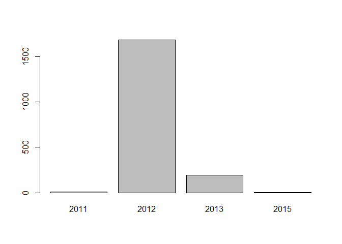
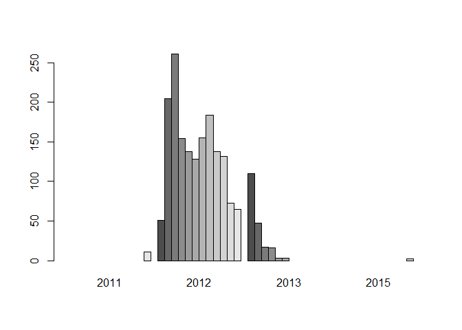
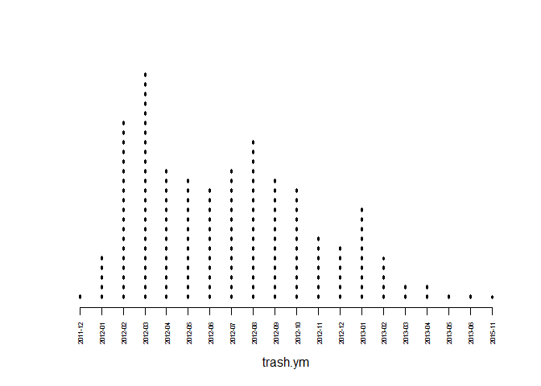
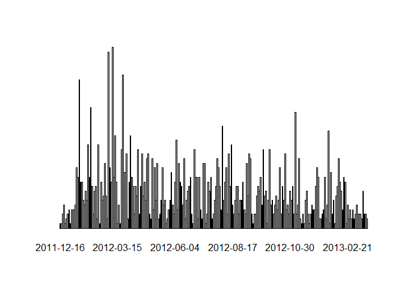
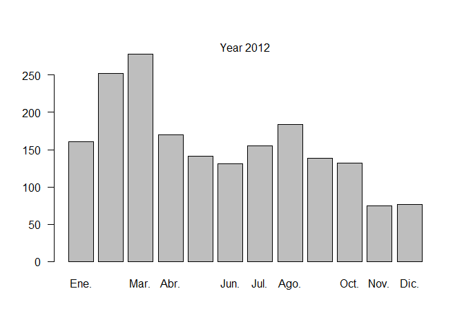
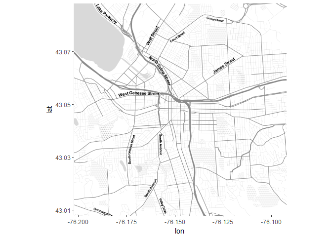
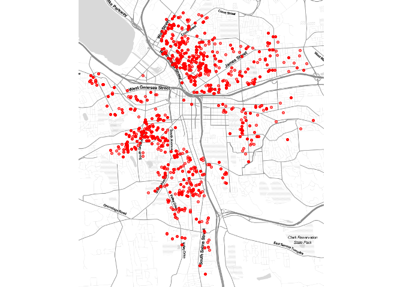
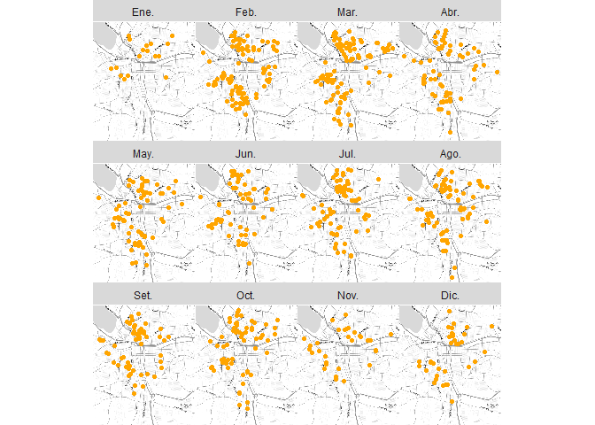

Lab 1 - DDM2
================
ignacio
February 1, 2017

``` r
#uploading the dataset
dat <- read.csv("https://raw.githubusercontent.com/lecy/code-orange/master/data/code%20violations.csv"
                 , header = TRUE
                 , stringsAsFactors = FALSE)

#Selecting columns: used colnames(dat) to find out which are the indexes i need
dat <- dat[,c(7,3,14,15)]

#converting the date from character to date type
dat$Violation.Date <- as.Date( dat$Violation.Date, format="%m/%d/%Y" )

#Creating new variables in the DF to manage dates

#1.YEAR as ordered factor
as.year <- format( dat$Violation.Date, format="%Y")
as.year <- factor(as.year,ordered=TRUE)
dat$year <- as.year

#2. MONTH as ordered factor
#we begin by making a vector 
m <- c("Ene.", "Feb.",  "Mar.", "Abr.", "May.", "Jun.", "Jul.", "Ago.", "Set.", "Oct.", "Nov.", "Dic.")
#create a factor using the vector m as the levels
as.month <- format( dat$Violation.Date, "%b" )
as.month <- factor( as.month, ordered=TRUE, levels=m )
table( as.month )[1:6] %>% pander
```

<table style="width:58%;">
<colgroup>
<col width="9%" />
<col width="9%" />
<col width="9%" />
<col width="9%" />
<col width="9%" />
<col width="9%" />
</colgroup>
<thead>
<tr class="header">
<th align="center">Ene.</th>
<th align="center">Feb.</th>
<th align="center">Mar.</th>
<th align="center">Abr.</th>
<th align="center">May.</th>
<th align="center">Jun.</th>
</tr>
</thead>
<tbody>
<tr class="odd">
<td align="center">4812</td>
<td align="center">4423</td>
<td align="center">3940</td>
<td align="center">3592</td>
<td align="center">4842</td>
<td align="center">5021</td>
</tr>
</tbody>
</table>

``` r
#adding this vector to the dataframe
dat$month <- as.month

#3. WEEK as ordered factor
as.week <- format( dat$Violation.Date, format="%W")
as.week <- factor( as.week, ordered=T)
dat$week <- as.week

#4. Day of the week as ordered factor
m <- c("lun.", "mar.", "mi?.", "jue.","vie.", "s?b.", "dom.")
as.day <- format( dat$Violation.Date, format="%a" )
as.day <- factor( as.day, ordered=TRUE, levels=m )
dat$day <-as.day


#Selecting the top 10  complain types
these <- names( sort( table( dat$Complaint.Type ), decreasing=T )[1:10] )
dat <- dat[ dat$Complaint.Type %in% these , ]

#changing them from characer to factor
dat$Complaint.Type <- as.factor( dat$Complaint.Type )

#changing the names of the levels
levels( dat$Complaint.Type )
```

    ##  [1] "Bed Bugs"                  "Building W/O Permit"      
    ##  [3] "Complaint Reqst - General" "Fire Safety"              
    ##  [5] "Illegal Trash Set Out"     "Infestation"              
    ##  [7] "Overgrowth: Private, Occ"  "Property Maintenance-Ext" 
    ##  [9] "Property Maintenance-Int"  "Trash/Debris-Private, Occ"

``` r
new.labels <- c("Bed Bugs","No Permit","General","Fire Hazard",
                "Illegal Trash","Infestation","Overgrown","Exterior Maintenance",
                "Interior Maintenance","Trash")
levels( dat$Complaint.Type ) <- new.labels
```

``` r
#creating a subdata set for only illegal trash outs.
trash <- dat[ dat$Complaint.Type == "Illegal Trash" , ]
levels(trash$year)
```

    ##  [1] "2007" "2008" "2009" "2010" "2011" "2012" "2013" "2014" "2015" "2016"

``` r
#eliminating unecesary factors
trash$year <- factor(trash$year)

table(trash$year)
```

    ## 
    ## 2011 2012 2013 2015 
    ##   11 1684  196    2

``` r
#per year
trash.y <- tapply(trash$year
                     , list(year= trash$year)
                     , length)
#barplot comparing years
barplot(trash.y, beside = T)
```



``` r
#per year and month
trash.y.m <- tapply(trash$year
                     , list(month= trash$month, 
                            year= trash$year)
                     , length)
#barplot comparing years
barplot(trash.y.m, beside = T)
```



``` r
#looking for months in all years

trash.ym <- format( trash$Violation.Date, "%Y-%m" )

table(trash.ym)
```

    ## trash.ym
    ## 2011-12 2012-01 2012-02 2012-03 2012-04 2012-05 2012-06 2012-07 2012-08 
    ##      11      51     205     261     154     138     128     155     184 
    ## 2012-09 2012-10 2012-11 2012-12 2013-01 2013-02 2013-03 2013-04 2013-05 
    ##     138     132      73      65     110      47      17      16       3 
    ## 2013-06 2015-11 
    ##       3       2

``` r
plot(table(trash.ym), lty=3, lwd=3, las=2, cex.axis=0.5, yaxt="n", ylab="")
```



``` r
#day in all months and years
trash.ymd <- format( trash$Violation.Date, "%Y-%m-%d" )
table(trash.ymd)
```

    ## trash.ymd
    ## 2011-12-16 2011-12-21 2011-12-22 2011-12-23 2011-12-30 2012-01-06 
    ##          1          1          3          5          1          2 
    ## 2012-01-12 2012-01-13 2012-01-18 2012-01-24 2012-01-25 2012-01-26 
    ##          3          4          1          4          4          4 
    ## 2012-01-27 2012-01-30 2012-01-31 2012-02-01 2012-02-02 2012-02-03 
    ##          5         13         11         32         10         10 
    ## 2012-02-06 2012-02-07 2012-02-08 2012-02-09 2012-02-10 2012-02-13 
    ##          6          5          8          6         18         11 
    ## 2012-02-14 2012-02-15 2012-02-16 2012-02-17 2012-02-21 2012-02-22 
    ##         26          9          3          8          9          2 
    ## 2012-02-23 2012-02-24 2012-02-27 2012-02-28 2012-02-29 2012-03-01 
    ##         18          1         10          6          7         14 
    ## 2012-03-02 2012-03-05 2012-03-06 2012-03-07 2012-03-08 2012-03-09 
    ##          7          2         38         13         10         39 
    ## 2012-03-12 2012-03-13 2012-03-14 2012-03-15 2012-03-16 2012-03-19 
    ##         11         20         10          1          5          1 
    ## 2012-03-20 2012-03-22 2012-03-26 2012-03-27 2012-03-29 2012-04-02 
    ##         17         33         12         12         16          2 
    ## 2012-04-03 2012-04-04 2012-04-06 2012-04-10 2012-04-11 2012-04-12 
    ##         10         20         11          9          3          9 
    ## 2012-04-16 2012-04-17 2012-04-18 2012-04-19 2012-04-20 2012-04-23 
    ##          7         17          3          9         16          7 
    ## 2012-04-24 2012-04-26 2012-04-27 2012-05-01 2012-05-02 2012-05-03 
    ##         10          6         15         16          3          2 
    ## 2012-05-04 2012-05-07 2012-05-08 2012-05-09 2012-05-11 2012-05-14 
    ##         15          4         13          6         14          2 
    ## 2012-05-15 2012-05-16 2012-05-17 2012-05-18 2012-05-21 2012-05-22 
    ##          3          6         13          5          6          1 
    ## 2012-05-23 2012-05-24 2012-05-25 2012-05-30 2012-05-31 2012-06-01 
    ##          2          4          6         12          5          3 
    ## 2012-06-04 2012-06-05 2012-06-06 2012-06-07 2012-06-08 2012-06-12 
    ##         10         19          4         14         10          9 
    ## 2012-06-13 2012-06-14 2012-06-15 2012-06-19 2012-06-21 2012-06-22 
    ##          5         15          2          6          8          9 
    ## 2012-06-27 2012-06-28 2012-07-02 2012-07-03 2012-07-05 2012-07-06 
    ##         11          3          1         17         11         11 
    ## 2012-07-09 2012-07-10 2012-07-11 2012-07-12 2012-07-16 2012-07-17 
    ##          2         11          4          2         14         14 
    ## 2012-07-18 2012-07-19 2012-07-20 2012-07-23 2012-07-24 2012-07-25 
    ##          1          3         10          8         11          2 
    ## 2012-07-26 2012-07-27 2012-07-30 2012-07-31 2012-08-02 2012-08-03 
    ##          3          6          9         15         13          9 
    ## 2012-08-06 2012-08-07 2012-08-08 2012-08-09 2012-08-10 2012-08-13 
    ##          4         22          6         10         13          3 
    ## 2012-08-14 2012-08-15 2012-08-16 2012-08-17 2012-08-20 2012-08-21 
    ##         16          9         18          5          3          6 
    ## 2012-08-22 2012-08-23 2012-08-24 2012-08-28 2012-08-29 2012-08-30 
    ##          9          9          3          6          6         10 
    ## 2012-08-31 2012-09-04 2012-09-05 2012-09-06 2012-09-10 2012-09-11 
    ##          4          3         14          7         16         15 
    ## 2012-09-12 2012-09-13 2012-09-14 2012-09-17 2012-09-18 2012-09-19 
    ##          3          1          3          3          7          9 
    ## 2012-09-20 2012-09-21 2012-09-24 2012-09-25 2012-09-26 2012-09-27 
    ##          8         11          5         17          7          8 
    ## 2012-09-28 2012-10-01 2012-10-02 2012-10-03 2012-10-04 2012-10-05 
    ##          1          6         17          5          6          3 
    ## 2012-10-09 2012-10-10 2012-10-12 2012-10-15 2012-10-16 2012-10-17 
    ##          5          7          4          6         13          3 
    ## 2012-10-19 2012-10-22 2012-10-23 2012-10-24 2012-10-26 2012-10-29 
    ##          9          6         16          4          5          3 
    ## 2012-10-30 2012-10-31 2012-11-01 2012-11-02 2012-11-06 2012-11-09 
    ##          8          6          9          3         25          3 
    ## 2012-11-14 2012-11-15 2012-11-16 2012-11-20 2012-11-21 2012-11-26 
    ##          5         15          2          1          3          1 
    ## 2012-11-27 2012-12-04 2012-12-06 2012-12-07 2012-12-10 2012-12-12 
    ##          6          8          3          1          3          5 
    ## 2012-12-13 2012-12-14 2012-12-17 2012-12-18 2012-12-19 2012-12-24 
    ##          4          4          9         13         11          2 
    ## 2012-12-26 2013-01-03 2013-01-07 2013-01-08 2013-01-11 2013-01-14 
    ##          2          3          4         11          2          5 
    ## 2013-01-15 2013-01-16 2013-01-18 2013-01-22 2013-01-23 2013-01-24 
    ##         21          1         12          3          6          1 
    ## 2013-01-25 2013-01-29 2013-01-30 2013-01-31 2013-02-01 2013-02-04 
    ##          7          9         15         10          8          4 
    ## 2013-02-07 2013-02-12 2013-02-14 2013-02-21 2013-02-25 2013-02-27 
    ##         11         10          1          5          2          4 
    ## 2013-02-28 2013-03-04 2013-03-05 2013-03-07 2013-03-11 2013-03-12 
    ##          2          4          2          3          5          3 
    ## 2013-04-03 2013-04-10 2013-04-11 2013-04-15 2013-05-09 2013-06-25 
    ##          3          3          2          8          3          3 
    ## 2015-11-18 
    ##          2

``` r
barplot(table(trash.ymd), cex.axis=5, yaxt="n", ylab="")
```



``` r
#selecting year 2012
trash2012 <- trash[ trash$year == "2012" , ]
trash2012$year <- factor(trash2012$year)
table(trash2012$year)
```

    ## 
    ## 2012 
    ## 1684

``` r
barplot(table(trash$month), las=1,ylab="")
mtext("Year 2012")
```



``` r
#removing latitudes and lon that are out of the map of syr
syr <- get_map( location="syracuse", zoom=13, maptype = "toner-lite")
ggmap( syr ) 
```



``` r
syr.min.lat <-  42.96
syr.max.lat <-  43.12
syr.min.lon <- -76.25
syr.max.lon <- -76.05

trash2012 <- trash2012[ trash2012$lat > syr.min.lat & trash2012$lat < syr.max.lat , ]
trash2012 <- trash2012[ trash2012$lon > syr.min.lon & trash2012$lon < syr.max.lon , ]

#the creation of a map
qmplot( lon, lat, data = trash2012, maptype="toner-lite", color=I("red"), alpha=0.3 ) + theme(legend.position="none")
```



``` r
#using facet wrap to output lots maps per month
qmplot( lon, lat, data = trash2012, maptype = "toner-lite", 
        color = I("orange") ) + facet_wrap(~ month )
```


