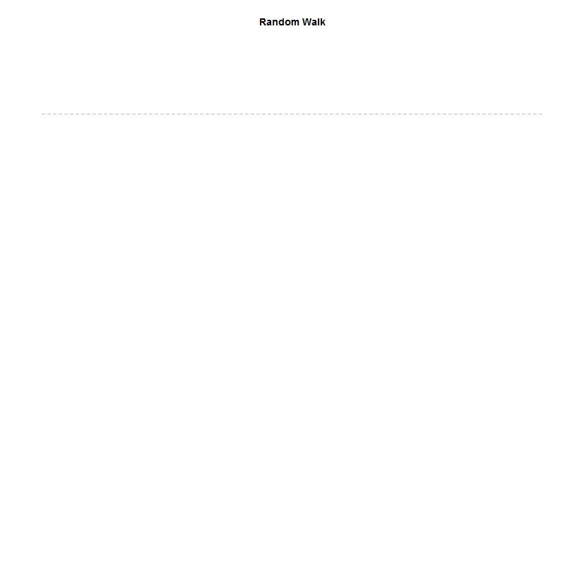

```{r setup, include=FALSE}

knitr::opts_chunk$set( message=F, warning=F )

```

```{r}
#install.packages("animation")
#install.packages("magick")
library(animation)
library(magick)

#creating the folder
dir.create("gifs")
setwd("gifs")

random.walk <- cumsum(rnorm(100))
max.y <- max(random.walk)
min.y <- min(random.walk)

saveGIF({
  for( i in 1:100 )
    {
    plot(random.walk[1:i], type="l"
        , col="darkred", axes=F, xlab="", ylab="", main="Random Walk"
        , xlim=c(1,100), ylim=c(min.y,max.y))
    abline( h=0, lty=2, col="gray" )
    }
}
, interval = 0.3
, movie.name = "random_walk.gif"
, ani.width = 800
, ani.height = 800)

```



