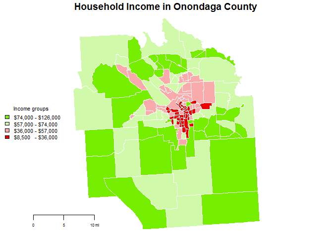
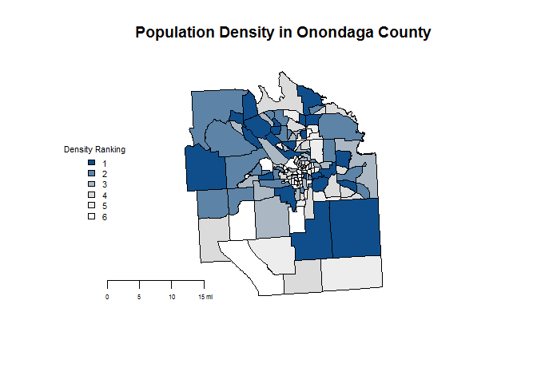
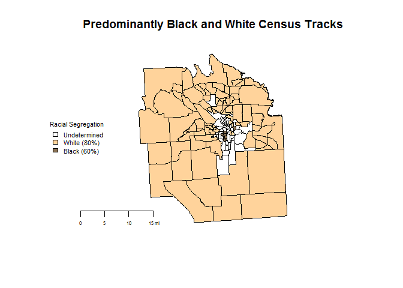
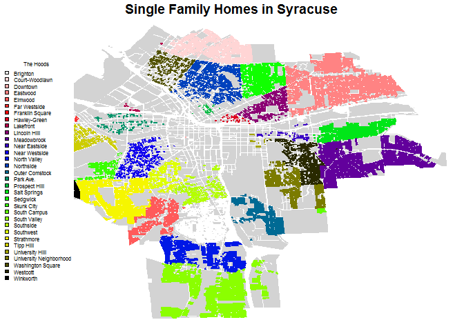
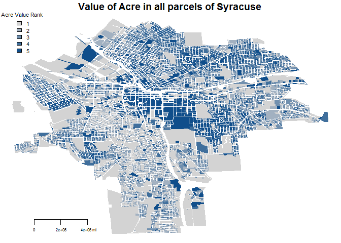
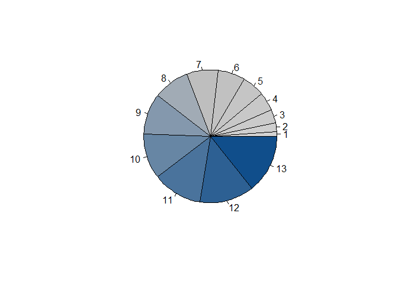
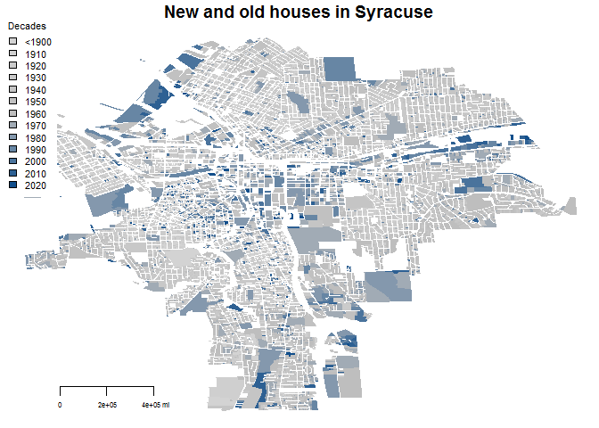

Lab3\_4\_DDMII
================
ignacio
February 2, 2017

### WEEK 1

### First, getting the files and wrangling the data

``` r
# 3 data sets: (1)cendus api data, (2)shape files from census and (3)parcels data

#extracting shape files
#download.file("ftp://ftp2.census.gov/geo/tiger/TIGER2010/TRACT/2010/tl_2010_36067_tract10.zip", "onondaga census tracts.zip" )
#unzip( "onondaga census tracts.zip" )
#file.remove( "onondaga census tracts.zip" )

#creating files: shape file and df
shapes <- readShapePoly(fn="C:\\Users\\icps\\Dropbox\\3. Maxwell\\3. Spring Term\\5. Data Driven II\\Lab3_4\\shapefiles\\tl_2010_36067_tract10"
                          ,proj4string=CRS("+proj=longlat +datum=WGS84"))

#exploring the census variables
#cdat <- read.csv("Census variables.csv")
#cdat %>% pander

###############################################

# download acs5 2015 for Population, Median Household income, White, Black, Asian, Hispanic or latino, Unemployed, Income < poverty level last 12 months, In Labor Force
censuskey <- "5a9ad013c3692d7dfdd344a9b2b774f36c50b43d"
dat <- getCensus(name="acs5", vintage=2015, key=censuskey, 
                       vars=c("B01001_001E", "B19013_001E", "B01001A_001E","B01001B_001E", "B01001D_001E", "B01001I_001E", "B23025_005E", "B17001_002E", "B23025_002E"), region="tract:*", regionin = "state: 36 + county: 067")

colnames(dat)[4:12] <- c("Pop", "MHincome", "White", "Black", "Asian", "Hispanic", "Unemployed", "Poverty", "Labor")

dat$p.Poverty <- dat$Poverty / dat$Labor
dat$p.White <- dat$White / dat$Pop
dat$p.Black <- dat$Black / dat$Pop
dat$p.Asian <- dat$Asian / dat$Pop
dat$p.Hispanic <- dat$Hispanic / dat$Pop
dat$p.Unemployed <- dat$Unemployed / dat$Labor

#reducing sice of dat
dat <- dat[,c(3:5,13:18)]
```

### 1.Household Income

``` r
summary(dat$MHincome)
```

    ##    Min. 1st Qu.  Median    Mean 3rd Qu.    Max.    NA's 
    ##    8942   35720   56230   54980   73510  125700       1

``` r
#Setting up the colors
f.color <- colorRampPalette( c("red2","white","chartreuse2"))
colors <- f.color( 4 ) # number of groups you desire

#dividing the ranked data into groups and adding color
shape.colors <- cut( rank(dat$MHincome), breaks=4, labels=colors)
shape.colors <- as.character(shape.colors)


order <- match(shapes$TRACTCE10, dat$tract) #this order is used in other two maps
shape.colors <- shape.colors[order]

par( mar=c(0,0,1,0))
plot(shapes, col=shape.colors, border = "white")
title(main="Household Income in Onondaga County", line = 0)
map.scale( metric=F, ratio=F, relwidth = 0.15, cex=0.5 )
legend( "left", bg="white"
        , cex=0.7
        , legend= rev(c("$8,500   - $36,000","$36,000 - $57,000","$57,000 - $74,000","$74,000 - $126,000"))
        , fill=rev(colors)
        , box.col="white"
        , title="Income groups" 
        )
```



### 3.Population density

``` r
#summary(dat$Pop)
#Setting up the colors
f.color <- colorRampPalette( c("white", "light grey","dodgerblue4"))
colors <- f.color( 6 ) # number of groups you desire

#pie(1:6, col=colors)

#dividing the ranked data into groups and adding color
shape.colors <- cut( rank(dat$Pop), breaks=6, labels=colors)
shape.colors <- as.character(shape.colors)

shape.colors <- shape.colors[order]

plot(shapes, col=shape.colors, main="Population Density in Onondaga County")
map.scale( metric=F, ratio=F, relwidth = 0.15, cex=0.5 )
legend( "left", bg="white"
        , legend = c(1:6)
        , cex=0.7
        , fill=rev(colors)
        , box.col="white"
        , title="Density Ranking" 
        )
```



### 3.Census Tracks with mayority Black and White population

``` r
#counties with mayority Black and white population
black <- dat$p.Black > .6
white <- dat$p.White > .8

#Setting up the colors
colors <- c("white","burlywood1","burlywood4")

shape.colors <- replicate(140,colors[1])

shape.colors[black] <- colors[3]
shape.colors[white] <- colors[2]

shape.colors <- shape.colors[order]

plot(shapes, col=shape.colors, main="Predominantly Black and White Census Tracks")
map.scale( metric=F, ratio=F, relwidth = 0.15, cex=0.5 )
legend( "left", bg="white"
        , cex=0.7
        , legend= rev(c("Black (60%)", "White (80%)", "Undetermined"))
        , fill=rev(colors[c(3,2,1)])
        , box.col="white"
        , title="Racial Segregation" 
        )
```



Getting more info from census api

``` r
# download acs5 2015 for Median Age, Single Mothers Below Poverty, Single Mothers Above Poverty, households
dat2 <- getCensus(name="acs5", vintage=2015, key=censuskey
                 ,vars=c("B01002A_001E", "B17010_017E", "B17010_037E")
                 , region="tract:*"
                 ,regionin = "state: 36 + county: 067")

colnames(dat2)[4:6] <- c("Age", "Smoms.p", "Smoms")
dat2$Smoms.t <- dat2$Smoms.p + dat2$Smoms
#reducing sice of dat
dat2 <- dat2[,c(3,4,5,7)]

#getting total number of households
x <- getCensus(name="sf1", vintage=2010, key=censuskey
                 ,vars=c("P0180001")
                 , region="tract:*"
                 ,regionin = "state: 36 + county: 067")
dat2$House <- x$P0180001
dat2$p.Smoms <- dat2$Smoms.t / dat2$House
```

### WEEK 2

### Question 1: How many single family homes are in each neighborhood?

``` r
#loading shapes of parcels
parcels <- readShapePoly(fn="C:\\Users\\icps\\Dropbox\\3. Maxwell\\3. Spring Term\\5. Data Driven II\\Lab3_4\\shapefiles\\01-05-2015"
                          ,proj4string=CRS("+proj=longlat +datum=WGS84"))

#str(parcels)

#aggregate function to create a data.frame of agregation amount of Smoms

x <- as.data.frame(parcels[,c("Nhood", "LandUse")])
x$Smoms <- x$LandUse == "Single Family"
ag.x <- aggregate(x$Smoms
                      , by = list(type = x$Nhood)
                      , FUN = sum)
colnames(ag.x)[2] <- "Single Families"

ag.x %>% pander
```

<table style="width:57%;">
<colgroup>
<col width="33%" />
<col width="23%" />
</colgroup>
<thead>
<tr class="header">
<th align="center">type</th>
<th align="center">Single Families</th>
</tr>
</thead>
<tbody>
<tr class="odd">
<td align="center">Brighton</td>
<td align="center">1398</td>
</tr>
<tr class="even">
<td align="center">Court-Woodlawn</td>
<td align="center">1859</td>
</tr>
<tr class="odd">
<td align="center">Downtown</td>
<td align="center">1</td>
</tr>
<tr class="even">
<td align="center">Eastwood</td>
<td align="center">3605</td>
</tr>
<tr class="odd">
<td align="center">Elmwood</td>
<td align="center">909</td>
</tr>
<tr class="even">
<td align="center">Far Westside</td>
<td align="center">471</td>
</tr>
<tr class="odd">
<td align="center">Franklin Square</td>
<td align="center">0</td>
</tr>
<tr class="even">
<td align="center">Hawley-Green</td>
<td align="center">52</td>
</tr>
<tr class="odd">
<td align="center">Lakefront</td>
<td align="center">24</td>
</tr>
<tr class="even">
<td align="center">Lincoln Hill</td>
<td align="center">580</td>
</tr>
<tr class="odd">
<td align="center">Meadowbrook</td>
<td align="center">1721</td>
</tr>
<tr class="even">
<td align="center">Near Eastside</td>
<td align="center">93</td>
</tr>
<tr class="odd">
<td align="center">Near Westside</td>
<td align="center">521</td>
</tr>
<tr class="even">
<td align="center">North Valley</td>
<td align="center">1194</td>
</tr>
<tr class="odd">
<td align="center">Northside</td>
<td align="center">1508</td>
</tr>
<tr class="even">
<td align="center">Outer Comstock</td>
<td align="center">697</td>
</tr>
<tr class="odd">
<td align="center">Park Ave.</td>
<td align="center">167</td>
</tr>
<tr class="even">
<td align="center">Prospect Hill</td>
<td align="center">29</td>
</tr>
<tr class="odd">
<td align="center">Salt Springs</td>
<td align="center">1029</td>
</tr>
<tr class="even">
<td align="center">Sedgwick</td>
<td align="center">892</td>
</tr>
<tr class="odd">
<td align="center">Skunk City</td>
<td align="center">345</td>
</tr>
<tr class="even">
<td align="center">South Campus</td>
<td align="center">25</td>
</tr>
<tr class="odd">
<td align="center">South Valley</td>
<td align="center">1605</td>
</tr>
<tr class="even">
<td align="center">Southside</td>
<td align="center">481</td>
</tr>
<tr class="odd">
<td align="center">Southwest</td>
<td align="center">419</td>
</tr>
<tr class="even">
<td align="center">Strathmore</td>
<td align="center">1475</td>
</tr>
<tr class="odd">
<td align="center">Tipp Hill</td>
<td align="center">785</td>
</tr>
<tr class="even">
<td align="center">University Hill</td>
<td align="center">17</td>
</tr>
<tr class="odd">
<td align="center">University Neighborhood</td>
<td align="center">803</td>
</tr>
<tr class="even">
<td align="center">Washington Square</td>
<td align="center">425</td>
</tr>
<tr class="odd">
<td align="center">Westcott</td>
<td align="center">851</td>
</tr>
<tr class="even">
<td align="center">Winkworth</td>
<td align="center">411</td>
</tr>
</tbody>
</table>

``` r
#if you want to make both data sets mergeable
#unique(shapes$TRACTCE10)
#x <- as.numeric(as.character(shapes$TRACTCE10)) / 100

##############################################

#Setting up the colors
colors <- c("light grey","cornflowerblue")

unique(parcels$Nhood)
```

    ##  [1] South Valley            North Valley           
    ##  [3] Elmwood                 Brighton               
    ##  [5] Strathmore              Outer Comstock         
    ##  [7] South Campus            Winkworth              
    ##  [9] University Neighborhood Southside              
    ## [11] Southwest               Meadowbrook            
    ## [13] Westcott                Near Westside          
    ## [15] Skunk City              University Hill        
    ## [17] Tipp Hill               Downtown               
    ## [19] Near Eastside           Park Ave.              
    ## [21] Salt Springs            Far Westside           
    ## [23] Hawley-Green            Lincoln Hill           
    ## [25] Prospect Hill           <NA>                   
    ## [27] Eastwood                Franklin Square        
    ## [29] Lakefront               Northside              
    ## [31] Sedgwick                Washington Square      
    ## [33] Court-Woodlawn         
    ## 32 Levels: Brighton Court-Woodlawn Downtown Eastwood ... Winkworth

``` r
#subsetting parcel data to have only single moms
parcels.smoms <- parcels[parcels$LandUse == "Single Family",]
parcels.not <- parcels[parcels$LandUse != "Single Family",]

#Setting up the colors
colors <- colorRampPalette(c("white","red","blue","green","yellow","black"))
colors <- colors( 32 ) # number of groups you desire
palette(colors)

#plotting two maps
par( mar=c(0,0,1,0))
  plot(parcels.not, border=F, lwd= .1, col="light grey")
  plot(parcels.smoms, lwd= .1, border=parcels.smoms$Nhood
       , col=parcels.smoms$Nhood
       , add=T)
  title(main="Single Family Homes in Syracuse", line = 0)
  legend("left"
         , bg="white"
         , cex=0.5
         , legend= c(as.character(levels(parcels$Nhood)))
         , fill=colors
         , box.col="white"
         , title="The Hoods" 
        )
```



### Question 2: Where does land in Syracuse have the highest value?

-   Create a table of the count of single family homes with values above $200k in each neighborhood, as a pecentage of all single family homes

-   Plot the value / acre of all parcels in Syracuse

``` r
#Total of24392 obs of Single Families

#determinig the amount of parcels with SingleFam and >200k

#creating a logical vector when the value is >200
q2 <- as.data.frame(parcels.smoms[,c("AssessedVa", "Nhood")])

x <- q2$AssessedVa >= 200000
q2$log <- x #adding the log vec to the dataframe

ag.q2 <- aggregate(q2$log
                   , by = list(Nhood = q2$Nhood)
                   , FUN = sum)
colnames(ag.q2)[2] <- "SingleFam200k"

ag.q2 %>% pander
```

<table style="width:54%;">
<colgroup>
<col width="33%" />
<col width="20%" />
</colgroup>
<thead>
<tr class="header">
<th align="center">Nhood</th>
<th align="center">SingleFam200k</th>
</tr>
</thead>
<tbody>
<tr class="odd">
<td align="center">Brighton</td>
<td align="center">0</td>
</tr>
<tr class="even">
<td align="center">Court-Woodlawn</td>
<td align="center">0</td>
</tr>
<tr class="odd">
<td align="center">Downtown</td>
<td align="center">0</td>
</tr>
<tr class="even">
<td align="center">Eastwood</td>
<td align="center">1</td>
</tr>
<tr class="odd">
<td align="center">Elmwood</td>
<td align="center">0</td>
</tr>
<tr class="even">
<td align="center">Far Westside</td>
<td align="center">0</td>
</tr>
<tr class="odd">
<td align="center">Hawley-Green</td>
<td align="center">0</td>
</tr>
<tr class="even">
<td align="center">Lakefront</td>
<td align="center">0</td>
</tr>
<tr class="odd">
<td align="center">Lincoln Hill</td>
<td align="center">7</td>
</tr>
<tr class="even">
<td align="center">Meadowbrook</td>
<td align="center">69</td>
</tr>
<tr class="odd">
<td align="center">Near Eastside</td>
<td align="center">0</td>
</tr>
<tr class="even">
<td align="center">Near Westside</td>
<td align="center">0</td>
</tr>
<tr class="odd">
<td align="center">North Valley</td>
<td align="center">0</td>
</tr>
<tr class="even">
<td align="center">Northside</td>
<td align="center">2</td>
</tr>
<tr class="odd">
<td align="center">Outer Comstock</td>
<td align="center">5</td>
</tr>
<tr class="even">
<td align="center">Park Ave.</td>
<td align="center">0</td>
</tr>
<tr class="odd">
<td align="center">Prospect Hill</td>
<td align="center">0</td>
</tr>
<tr class="even">
<td align="center">Salt Springs</td>
<td align="center">0</td>
</tr>
<tr class="odd">
<td align="center">Sedgwick</td>
<td align="center">137</td>
</tr>
<tr class="even">
<td align="center">Skunk City</td>
<td align="center">0</td>
</tr>
<tr class="odd">
<td align="center">South Campus</td>
<td align="center">0</td>
</tr>
<tr class="even">
<td align="center">South Valley</td>
<td align="center">5</td>
</tr>
<tr class="odd">
<td align="center">Southside</td>
<td align="center">0</td>
</tr>
<tr class="even">
<td align="center">Southwest</td>
<td align="center">0</td>
</tr>
<tr class="odd">
<td align="center">Strathmore</td>
<td align="center">19</td>
</tr>
<tr class="even">
<td align="center">Tipp Hill</td>
<td align="center">0</td>
</tr>
<tr class="odd">
<td align="center">University Hill</td>
<td align="center">1</td>
</tr>
<tr class="even">
<td align="center">University Neighborhood</td>
<td align="center">18</td>
</tr>
<tr class="odd">
<td align="center">Washington Square</td>
<td align="center">0</td>
</tr>
<tr class="even">
<td align="center">Westcott</td>
<td align="center">0</td>
</tr>
<tr class="odd">
<td align="center">Winkworth</td>
<td align="center">11</td>
</tr>
</tbody>
</table>

``` r
#calculating the total Single families
t.smoms <- as.data.frame(table(parcels.smoms$Nhood))
colnames(t.smoms) <- c("Nhood", "Total")

#missing Nhood
match(t.smoms$Nhood, ag.q2$Nhood)
```

    ##  [1]  1  2  3  4  5  6 NA  7  8  9 10 11 12 13 14 15 16 17 18 19 20 21 22
    ## [24] 23 24 25 26 27 28 29 30 31

``` r
t.smoms$Nhood[7]
```

    ## [1] Franklin Square
    ## 32 Levels: Brighton Court-Woodlawn Downtown Eastwood ... Winkworth

``` r
# Missing Nhood is "Franklin Square"

t.smoms$s200k <- c(ag.q2$SingleFam200k[1:6], 0 ,ag.q2$SingleFam200k[7:31])

t.smoms$percent <- t.smoms$s200k / t.smoms$Total * 100

t.smoms %>% pander
```

<table style="width:68%;">
<colgroup>
<col width="33%" />
<col width="11%" />
<col width="11%" />
<col width="12%" />
</colgroup>
<thead>
<tr class="header">
<th align="center">Nhood</th>
<th align="center">Total</th>
<th align="center">s200k</th>
<th align="center">percent</th>
</tr>
</thead>
<tbody>
<tr class="odd">
<td align="center">Brighton</td>
<td align="center">1398</td>
<td align="center">0</td>
<td align="center">0</td>
</tr>
<tr class="even">
<td align="center">Court-Woodlawn</td>
<td align="center">1859</td>
<td align="center">0</td>
<td align="center">0</td>
</tr>
<tr class="odd">
<td align="center">Downtown</td>
<td align="center">1</td>
<td align="center">0</td>
<td align="center">0</td>
</tr>
<tr class="even">
<td align="center">Eastwood</td>
<td align="center">3605</td>
<td align="center">1</td>
<td align="center">0.02774</td>
</tr>
<tr class="odd">
<td align="center">Elmwood</td>
<td align="center">909</td>
<td align="center">0</td>
<td align="center">0</td>
</tr>
<tr class="even">
<td align="center">Far Westside</td>
<td align="center">471</td>
<td align="center">0</td>
<td align="center">0</td>
</tr>
<tr class="odd">
<td align="center">Franklin Square</td>
<td align="center">0</td>
<td align="center">0</td>
<td align="center">NA</td>
</tr>
<tr class="even">
<td align="center">Hawley-Green</td>
<td align="center">52</td>
<td align="center">0</td>
<td align="center">0</td>
</tr>
<tr class="odd">
<td align="center">Lakefront</td>
<td align="center">24</td>
<td align="center">0</td>
<td align="center">0</td>
</tr>
<tr class="even">
<td align="center">Lincoln Hill</td>
<td align="center">580</td>
<td align="center">7</td>
<td align="center">1.207</td>
</tr>
<tr class="odd">
<td align="center">Meadowbrook</td>
<td align="center">1721</td>
<td align="center">69</td>
<td align="center">4.009</td>
</tr>
<tr class="even">
<td align="center">Near Eastside</td>
<td align="center">93</td>
<td align="center">0</td>
<td align="center">0</td>
</tr>
<tr class="odd">
<td align="center">Near Westside</td>
<td align="center">521</td>
<td align="center">0</td>
<td align="center">0</td>
</tr>
<tr class="even">
<td align="center">North Valley</td>
<td align="center">1194</td>
<td align="center">0</td>
<td align="center">0</td>
</tr>
<tr class="odd">
<td align="center">Northside</td>
<td align="center">1508</td>
<td align="center">2</td>
<td align="center">0.1326</td>
</tr>
<tr class="even">
<td align="center">Outer Comstock</td>
<td align="center">697</td>
<td align="center">5</td>
<td align="center">0.7174</td>
</tr>
<tr class="odd">
<td align="center">Park Ave.</td>
<td align="center">167</td>
<td align="center">0</td>
<td align="center">0</td>
</tr>
<tr class="even">
<td align="center">Prospect Hill</td>
<td align="center">29</td>
<td align="center">0</td>
<td align="center">0</td>
</tr>
<tr class="odd">
<td align="center">Salt Springs</td>
<td align="center">1029</td>
<td align="center">0</td>
<td align="center">0</td>
</tr>
<tr class="even">
<td align="center">Sedgwick</td>
<td align="center">892</td>
<td align="center">137</td>
<td align="center">15.36</td>
</tr>
<tr class="odd">
<td align="center">Skunk City</td>
<td align="center">345</td>
<td align="center">0</td>
<td align="center">0</td>
</tr>
<tr class="even">
<td align="center">South Campus</td>
<td align="center">25</td>
<td align="center">0</td>
<td align="center">0</td>
</tr>
<tr class="odd">
<td align="center">South Valley</td>
<td align="center">1605</td>
<td align="center">5</td>
<td align="center">0.3115</td>
</tr>
<tr class="even">
<td align="center">Southside</td>
<td align="center">481</td>
<td align="center">0</td>
<td align="center">0</td>
</tr>
<tr class="odd">
<td align="center">Southwest</td>
<td align="center">419</td>
<td align="center">0</td>
<td align="center">0</td>
</tr>
<tr class="even">
<td align="center">Strathmore</td>
<td align="center">1475</td>
<td align="center">19</td>
<td align="center">1.288</td>
</tr>
<tr class="odd">
<td align="center">Tipp Hill</td>
<td align="center">785</td>
<td align="center">0</td>
<td align="center">0</td>
</tr>
<tr class="even">
<td align="center">University Hill</td>
<td align="center">17</td>
<td align="center">1</td>
<td align="center">5.882</td>
</tr>
<tr class="odd">
<td align="center">University Neighborhood</td>
<td align="center">803</td>
<td align="center">18</td>
<td align="center">2.242</td>
</tr>
<tr class="even">
<td align="center">Washington Square</td>
<td align="center">425</td>
<td align="center">0</td>
<td align="center">0</td>
</tr>
<tr class="odd">
<td align="center">Westcott</td>
<td align="center">851</td>
<td align="center">0</td>
<td align="center">0</td>
</tr>
<tr class="even">
<td align="center">Winkworth</td>
<td align="center">411</td>
<td align="center">11</td>
<td align="center">2.676</td>
</tr>
</tbody>
</table>

``` r
#######################################

#getting the colors i want
f.color <- colorRampPalette( c("light grey","dodgerblue4"))
colors <- f.color( 5 ) # number of groups 

#creating the variable with assesd value / acres
parcels$AVacre <- parcels$AssessedVa / parcels$Acres

#determining color
shape.colors <- cut( rank(parcels$AVacre), breaks=5, labels=colors)
shape.colors <- as.character(shape.colors)

#plot
par( mar=c(0,0,1,0))
  plot(parcels, col=shape.colors, border = F)
  title(main="Value of Acre in all parcels of Syracuse", line = 0)
  legend("topleft"
         , bg="white"
         , cex=.7
         , legend= c(1:5)
         , fill=colors
         , box.col="white"
         , title="Acre Value Rank" 
        )
  map.scale( metric=F, ratio=F, relwidth = 0.15, cex=0.5 )
```



### Question 3: What is the age of single family homes in each neighborhood?

-Create a table that reports the 10th, 25th, 50th, 75th, and 90th percentile of home ages in each neighborhood.

``` r
q3 <- as.data.frame(parcels.smoms)
q3 <- mutate(q3, age = 2017 - as.numeric(as.character(YearBuilt)))
q3group <- group_by(q3, Nhood)

table <- summarize(q3group
                   , tenth = quantile(age, .1, na.rm = T)
                   , twentyFifth = quantile(age, .25, na.rm = T)
                   , median = quantile(age, .5, na.rm = T)
                   , seventyFifth = quantile(age, .75, na.rm = T)
                   , ninetyth = quantile(age, .9, na.rm = T)
                   )

table <- arrange(table, desc(median))
table %>% pander
```

<table>
<colgroup>
<col width="30%" />
<col width="10%" />
<col width="17%" />
<col width="11%" />
<col width="18%" />
<col width="12%" />
</colgroup>
<thead>
<tr class="header">
<th align="center">Nhood</th>
<th align="center">tenth</th>
<th align="center">twentyFifth</th>
<th align="center">median</th>
<th align="center">seventyFifth</th>
<th align="center">ninetyth</th>
</tr>
</thead>
<tbody>
<tr class="odd">
<td align="center">Hawley-Green</td>
<td align="center">88.0</td>
<td align="center">107.00</td>
<td align="center">117</td>
<td align="center">127</td>
<td align="center">146.1</td>
</tr>
<tr class="even">
<td align="center">Washington Square</td>
<td align="center">87.0</td>
<td align="center">97.00</td>
<td align="center">117</td>
<td align="center">137</td>
<td align="center">157.0</td>
</tr>
<tr class="odd">
<td align="center">Lakefront</td>
<td align="center">88.6</td>
<td align="center">97.00</td>
<td align="center">112</td>
<td align="center">127</td>
<td align="center">137.0</td>
</tr>
<tr class="even">
<td align="center">Far Westside</td>
<td align="center">87.0</td>
<td align="center">97.00</td>
<td align="center">107</td>
<td align="center">117</td>
<td align="center">127.0</td>
</tr>
<tr class="odd">
<td align="center">Northside</td>
<td align="center">87.0</td>
<td align="center">97.00</td>
<td align="center">107</td>
<td align="center">117</td>
<td align="center">127.0</td>
</tr>
<tr class="even">
<td align="center">Park Ave.</td>
<td align="center">87.0</td>
<td align="center">97.00</td>
<td align="center">107</td>
<td align="center">117</td>
<td align="center">127.0</td>
</tr>
<tr class="odd">
<td align="center">Tipp Hill</td>
<td align="center">77.9</td>
<td align="center">92.00</td>
<td align="center">107</td>
<td align="center">117</td>
<td align="center">127.0</td>
</tr>
<tr class="even">
<td align="center">Brighton</td>
<td align="center">62.0</td>
<td align="center">87.00</td>
<td align="center">97</td>
<td align="center">107</td>
<td align="center">117.0</td>
</tr>
<tr class="odd">
<td align="center">Lincoln Hill</td>
<td align="center">32.0</td>
<td align="center">87.00</td>
<td align="center">97</td>
<td align="center">117</td>
<td align="center">127.0</td>
</tr>
<tr class="even">
<td align="center">Near Eastside</td>
<td align="center">74.1</td>
<td align="center">82.00</td>
<td align="center">97</td>
<td align="center">112</td>
<td align="center">127.0</td>
</tr>
<tr class="odd">
<td align="center">Near Westside</td>
<td align="center">16.5</td>
<td align="center">28.00</td>
<td align="center">97</td>
<td align="center">117</td>
<td align="center">136.4</td>
</tr>
<tr class="even">
<td align="center">Prospect Hill</td>
<td align="center">75.0</td>
<td align="center">87.00</td>
<td align="center">97</td>
<td align="center">117</td>
<td align="center">130.0</td>
</tr>
<tr class="odd">
<td align="center">Skunk City</td>
<td align="center">55.7</td>
<td align="center">87.00</td>
<td align="center">97</td>
<td align="center">117</td>
<td align="center">127.0</td>
</tr>
<tr class="even">
<td align="center">Southside</td>
<td align="center">24.0</td>
<td align="center">87.00</td>
<td align="center">97</td>
<td align="center">116</td>
<td align="center">117.0</td>
</tr>
<tr class="odd">
<td align="center">University Hill</td>
<td align="center">73.0</td>
<td align="center">87.00</td>
<td align="center">97</td>
<td align="center">107</td>
<td align="center">114.0</td>
</tr>
<tr class="even">
<td align="center">Westcott</td>
<td align="center">62.0</td>
<td align="center">82.00</td>
<td align="center">92</td>
<td align="center">100</td>
<td align="center">117.0</td>
</tr>
<tr class="odd">
<td align="center">Strathmore</td>
<td align="center">61.0</td>
<td align="center">81.00</td>
<td align="center">91</td>
<td align="center">97</td>
<td align="center">109.0</td>
</tr>
<tr class="even">
<td align="center">Downtown</td>
<td align="center">89.0</td>
<td align="center">89.00</td>
<td align="center">89</td>
<td align="center">89</td>
<td align="center">89.0</td>
</tr>
<tr class="odd">
<td align="center">Elmwood</td>
<td align="center">61.3</td>
<td align="center">82.00</td>
<td align="center">89</td>
<td align="center">97</td>
<td align="center">117.0</td>
</tr>
<tr class="even">
<td align="center">University Neighborhood</td>
<td align="center">65.0</td>
<td align="center">71.00</td>
<td align="center">89</td>
<td align="center">97</td>
<td align="center">107.0</td>
</tr>
<tr class="odd">
<td align="center">Court-Woodlawn</td>
<td align="center">64.0</td>
<td align="center">74.00</td>
<td align="center">88</td>
<td align="center">97</td>
<td align="center">117.0</td>
</tr>
<tr class="even">
<td align="center">Eastwood</td>
<td align="center">62.0</td>
<td align="center">74.00</td>
<td align="center">87</td>
<td align="center">97</td>
<td align="center">102.0</td>
</tr>
<tr class="odd">
<td align="center">Sedgwick</td>
<td align="center">64.0</td>
<td align="center">73.75</td>
<td align="center">87</td>
<td align="center">95</td>
<td align="center">107.0</td>
</tr>
<tr class="even">
<td align="center">Southwest</td>
<td align="center">16.5</td>
<td align="center">24.00</td>
<td align="center">87</td>
<td align="center">107</td>
<td align="center">117.0</td>
</tr>
<tr class="odd">
<td align="center">North Valley</td>
<td align="center">57.0</td>
<td align="center">62.00</td>
<td align="center">82</td>
<td align="center">92</td>
<td align="center">105.0</td>
</tr>
<tr class="even">
<td align="center">Salt Springs</td>
<td align="center">55.0</td>
<td align="center">62.00</td>
<td align="center">77</td>
<td align="center">89</td>
<td align="center">97.0</td>
</tr>
<tr class="odd">
<td align="center">Meadowbrook</td>
<td align="center">57.0</td>
<td align="center">62.00</td>
<td align="center">67</td>
<td align="center">85</td>
<td align="center">91.0</td>
</tr>
<tr class="even">
<td align="center">Outer Comstock</td>
<td align="center">52.0</td>
<td align="center">58.00</td>
<td align="center">67</td>
<td align="center">76</td>
<td align="center">92.0</td>
</tr>
<tr class="odd">
<td align="center">South Valley</td>
<td align="center">54.0</td>
<td align="center">62.00</td>
<td align="center">67</td>
<td align="center">87</td>
<td align="center">97.0</td>
</tr>
<tr class="even">
<td align="center">Winkworth</td>
<td align="center">46.0</td>
<td align="center">57.00</td>
<td align="center">62</td>
<td align="center">69</td>
<td align="center">87.0</td>
</tr>
<tr class="odd">
<td align="center">South Campus</td>
<td align="center">30.8</td>
<td align="center">52.00</td>
<td align="center">60</td>
<td align="center">71</td>
<td align="center">89.0</td>
</tr>
</tbody>
</table>

-Create a choropleth map that shows the age of properties by decade, pre-1900s can be one category.

``` r
#formatting the date
q3 <- as.data.frame(parcels)
q3 <- as.numeric(as.character(q3$YearBuilt))
q3[q3 == 0] <- NA
summary(q3) %>% pander
```

<table style="width:79%;">
<colgroup>
<col width="9%" />
<col width="13%" />
<col width="12%" />
<col width="9%" />
<col width="13%" />
<col width="9%" />
<col width="9%" />
</colgroup>
<thead>
<tr class="header">
<th align="center">Min.</th>
<th align="center">1st Qu.</th>
<th align="center">Median</th>
<th align="center">Mean</th>
<th align="center">3rd Qu.</th>
<th align="center">Max.</th>
<th align="center">NA's</th>
</tr>
</thead>
<tbody>
<tr class="odd">
<td align="center">1790</td>
<td align="center">1910</td>
<td align="center">1925</td>
<td align="center">1929</td>
<td align="center">1949</td>
<td align="center">2014</td>
<td align="center">4729</td>
</tr>
</tbody>
</table>

``` r
#getting the colors i want

f.color <- colorRampPalette( c("light grey", "grey", "dodgerblue4"))
colors <- f.color( 13 ) # number of groups 
pie(1:13, col=colors)
```



``` r
shape.colors <- cut(q3, breaks=c(1790, seq(from = 1900, to = 2020, by =10)), labels=colors)  
shape.colors <- as.character(shape.colors)

par( mar=c(0,0,1,0))
  plot(parcels, col=shape.colors, border = F)
  title(main="New and old houses in Syracuse", line = 0)
  legend("topleft"
         , bg="white"
         , cex=.7
         , legend= c("<1900", seq(from = 1910, to = 2020, by =10))
         , fill=colors
         , box.col="white"
         , title="Decades" 
        )
  map.scale( metric=F, ratio=F, relwidth = 0.15, cex=0.5 )
```


