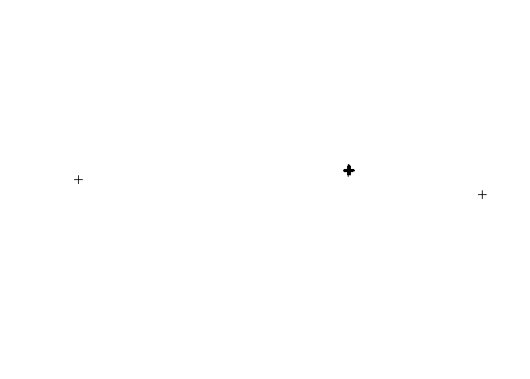
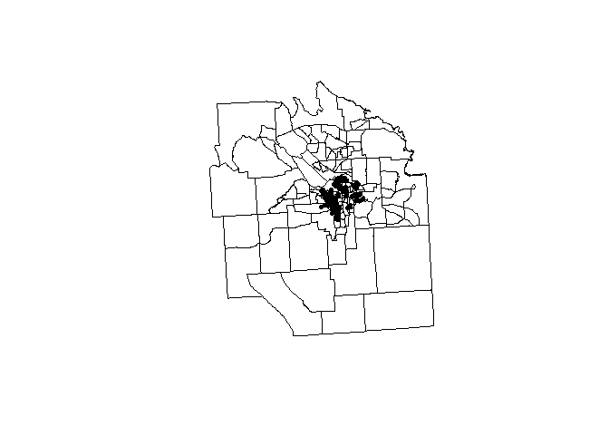
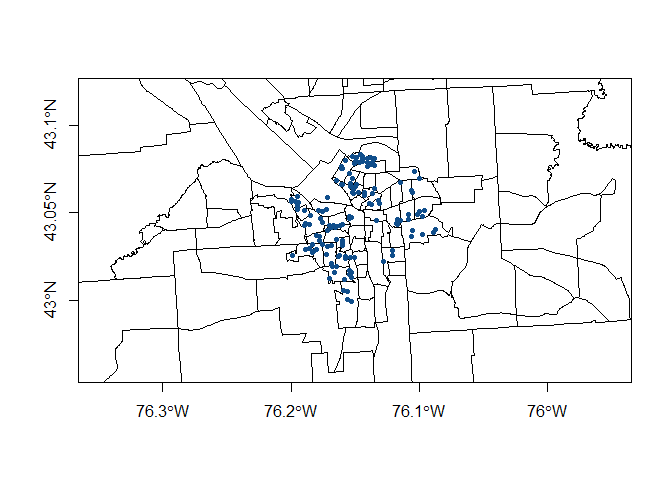

lab5
================
ignacio
February 21, 2017

1.  Load dataset of home prices and assests from Zillow

<!-- -->

    #loading the dataset
    dat <- read.csv( "https://github.com/lecy/hedonic-prices/raw/master/Data/Housing%20Price%20In-Class%20Exercise%20(Responses).csv", stringsAsFactors=FALSE )
    str( dat )

    #fixing some variables
    dat$House.Price <- as.numeric(gsub( ",","", dat$House.Price ))

1.  Add a census tract FIPS ID to each home (spatial join)

<!-- -->

    #cleaning the addresses
    Fadd <- dat$Street.Address.of.House
    Fadd <- gsub( ",","", Fadd ) #deleting comas
    Fadd <- gsub( "\\d{5}$","", Fadd ) #deleting ZIPcodes
    Fadd <- gsub( "Syracuse NY", "", Fadd) #delleting city and state
    Fadd <- gsub( "APT \\d{1,3}", "", Fadd) #delleting aptments
    Fadd <- gsub( "Street", "St", Fadd) #complying to my OCD for names
    Fadd <- gsub( "St.", "St", Fadd) #complying to my OCD for names
    Fadd <- gsub( "\\.", "", Fadd)
    Fadd <- gsub( "\\s{1,}$", "", Fadd) #remove blank spaces at the end
    Fadd <- paste(Fadd, "Syracuse", "NY", sep=", ")

    dat$Fadd <- Fadd #Adding the new addresses to the dataframe

    #Geocoding
    coo <- geocode(Fadd, messaging = F) #geocoding
    dat <- cbind(dat, coo) #binding the geocode with the dataset
    save(dat,file="dat_coo.Rda") #saving theobject to avoid geocoding every time.

Adding the FIPS tract

``` r
load("dat_coo.Rda")
coordinates(dat) = ~lon+lat #making it a coordinates object
plot(dat)
```



``` r
#removing latitudes and lon that are out of the map of syr
syr.min.lon <- -76.25 #x values
syr.max.lon <- -76.05

syr.min.lat <-  42.96 #y values
syr.max.lat <-  43.12


dat <- dat[ dat$lat > syr.min.lat & dat$lat < syr.max.lat , ]
dat <- dat[ dat$lon > syr.min.lon & dat$lon < syr.max.lon , ]

plot(dat)
```


``` r
#creating files: shape file and df
shapes <- readShapePoly(fn="C:\\Users\\icps\\Dropbox\\3. Maxwell\\3. Spring Term\\5. Data Driven II\\Labs\\Instructions\\Lab3_4\\shapefiles\\tl_2010_36067_tract10"
                          ,proj4string=CRS("+proj=longlat +datum=WGS84"))

class(dat)
```

    ## [1] "SpatialPointsDataFrame"
    ## attr(,"package")
    ## [1] "sp"

``` r
class(shapes)
```

    ## [1] "SpatialPolygonsDataFrame"
    ## attr(,"package")
    ## [1] "sp"

``` r
plot(shapes)
  points(dat, pch=20)
```



``` r
plot(shapes
     , xlim=c(syr.min.lon, syr.max.lon)
     , ylim=c(syr.min.lat, syr.max.lat) ) 
  points(dat, pch=20)
```



``` r
#i dont know what this means, but dat and shapes proj4strings must be the same
#look at: http://r-sig-geo.2731867.n2.nabble.com/point-in-polygon-or-over-help-td7583635.html
proj4string(dat)
```

    ## [1] NA

``` r
proj4string(shapes)
```

    ## [1] "+proj=longlat +datum=WGS84"

``` r
proj4string(dat) <- CRS("+proj=longlat +datum=WGS84") 

#Points in poly
pp <- point.in.poly( dat, shapes )
head(pp@data)
```

    ##         Timestamp House.Price  X X.1 Square.Feet      Your.Name
    ## 1 1/15/2015 16:11      179900 NA  NA    1,600.00 Emily Simonson
    ## 2 1/15/2015 16:17      128000 NA  NA    1,992.00 Emily Simonson
    ## 3 1/15/2015 16:25      114900 NA  NA    1,378.00 Emily Simonson
    ## 4 1/15/2015 16:34      107500 NA  NA    1,452.00 Emily Simonson
    ## 5 1/15/2015 16:41       43000 NA  NA         850 Emily Simonson
    ## 6 1/15/2015 16:52       85000 NA  NA    1,639.00 Emily Simonson
    ##   Lot.Size..in.SQUARE.FEET. Number.of.Bedrooms Number.of.Bathrooms
    ## 1                 43,560.00                  3                 2.0
    ## 2                  6,969.00                  4                 2.5
    ## 3                  5,227.00                  4                 1.0
    ## 4                  5,227.00                  3                 1.0
    ## 5                  6,098.00                  2                 1.0
    ## 6                  7,840.00                  4                 1.0
    ##   Does.it.have.a.garage. Year.Built Elementary.School.Score
    ## 1                    Yes       1994                       9
    ## 2                    Yes       1950                       2
    ## 3                    Yes       1930                       2
    ## 4                    Yes       1931                       2
    ## 5                    Yes       1955                       2
    ## 6                     No       1915                       2
    ##   Middle.School.Score High.School.Score Walk.Score Property.Taxes
    ## 1                   4                 2         15       3,182.00
    ## 2                   4                 2         43       1,393.00
    ## 3                   4                 2         50       1,331.00
    ## 4                   4                 1         42            157
    ## 5                   9                 1         57       1,525.00
    ## 6                   4                 1         36       2,184.00
    ##   Is.it.within.two.blocks.of.a.highway.or.interstate.
    ## 1                                                  No
    ## 2                                                  No
    ## 3                                                  No
    ## 4                                                  No
    ## 5                                                  No
    ## 6                                                  No
    ##   Walking.distance.to.the.nearest.good.restaurant...in.MINUTES...
    ## 1                                                              22
    ## 2                                                               7
    ## 3                                                               6
    ## 4                                                              12
    ## 5                                                               8
    ## 6                                                              32
    ##   Driving.distance.to.the.nearest.Starbucks...in.MILES...
    ## 1                                                     3.2
    ## 2                                                     2.6
    ## 3                                                     2.6
    ## 4                                                     2.6
    ## 5                                                     2.3
    ## 6                                                     1.9
    ##   Walking.distance.to.the.nearest.large.park..at.least.4.square.blocks..in.MINUTES.
    ## 1                                                                                18
    ## 2                                                                                 5
    ## 3                                                                                 7
    ## 4                                                                                 8
    ## 5                                                                                20
    ## 6                                                                                11
    ##   Driving.distance.to.the.nearest.strip.or.shopping.mall...in.MILES...
    ## 1                                                                  1.3
    ## 2                                                                  0.6
    ## 3                                                                  0.5
    ## 4                                                                  0.8
    ## 5                                                                  0.6
    ## 6                                                                  2.5
    ##   Street.Address.of.House Zip.Code
    ## 1      504 Winkworth Pkwy    13219
    ## 2          136 Austin Ave    13207
    ## 3          701 Velasko Rd    13207
    ## 4         518 Wolcott Ave    13207
    ## 5         112 Wolcott Ave    13207
    ## 6         212 Roberts Ave    13207
    ##   The.Census.Tract.in.which.the.house.resides.
    ## 1                                           NA
    ## 2                                           NA
    ## 3                                           NA
    ## 4                                           NA
    ## 5                                           NA
    ## 6                                           NA
    ##                               Fadd STATEFP10 COUNTYFP10 TRACTCE10
    ## 1 504 Winkworth Pkwy, Syracuse, NY        36        067    004800
    ## 2     136 Austin Ave, Syracuse, NY        36        067    004800
    ## 3     701 Velasko Rd, Syracuse, NY        36        067    004800
    ## 4    518 Wolcott Ave, Syracuse, NY        36        067    004800
    ## 5    112 Wolcott Ave, Syracuse, NY        36        067    004800
    ## 6    212 Roberts Ave, Syracuse, NY        36        067    005000
    ##       GEOID10 NAME10      NAMELSAD10 MTFCC10 FUNCSTAT10 ALAND10 AWATER10
    ## 1 36067004800     48 Census Tract 48   G5020          S 1206079        0
    ## 2 36067004800     48 Census Tract 48   G5020          S 1206079        0
    ## 3 36067004800     48 Census Tract 48   G5020          S 1206079        0
    ## 4 36067004800     48 Census Tract 48   G5020          S 1206079        0
    ## 5 36067004800     48 Census Tract 48   G5020          S 1206079        0
    ## 6 36067005000     50 Census Tract 50   G5020          S 1149255    45948
    ##    INTPTLAT10   INTPTLON10
    ## 1 +43.0279451 -076.1920648
    ## 2 +43.0279451 -076.1920648
    ## 3 +43.0279451 -076.1920648
    ## 4 +43.0279451 -076.1920648
    ## 5 +43.0279451 -076.1920648
    ## 6 +43.0272963 -076.1689815

``` r
dim(pp@data)
```

    ## [1] 146  37

``` r
dim(dat@data)
```

    ## [1] 146  25

``` r
#looking at how many points in each poly
x <- tapply(pp@data$Fadd, pp@data$TRACTCE10, FUN=length)
x <- x[is.na(x) == F]
x <- as.data.frame(x)

x
```

    ##         x
    ## 000100  1
    ## 000200  4
    ## 000300  9
    ## 000400  8
    ## 000501  6
    ## 000600  5
    ## 001000  2
    ## 001400  5
    ## 001500  4
    ## 001600  2
    ## 001702  1
    ## 001800  1
    ## 001900  1
    ## 002000  7
    ## 002101  3
    ## 002400  3
    ## 002700  3
    ## 002901  6
    ## 003200  3
    ## 003400  3
    ## 003500  4
    ## 003601  2
    ## 003602  4
    ## 003800  3
    ## 004000 10
    ## 004600  7
    ## 004800  5
    ## 004900  3
    ## 005000  4
    ## 005100  4
    ## 005200  4
    ## 005400  1
    ## 005601  3
    ## 005700  5
    ## 005800  5
    ## 006000  4
    ## 014200  1

``` r
sum(x$x) #146 points!
```

    ## [1] 146

``` r
#average price per census tract
x <- tapply(pp@data$House.Price, pp@data$TRACTCE10, FUN=mean)
x <- x[is.na.data.frame(x) == F]
x <- as.data.frame(x)
```

1.  Add census data to each home

2.  Aggregate crimes by census tract(spatial join) and add to the dataset.

Lab6
----

1.  Create a map of property values in Buffalo
2.  Create a map of the change in property values
