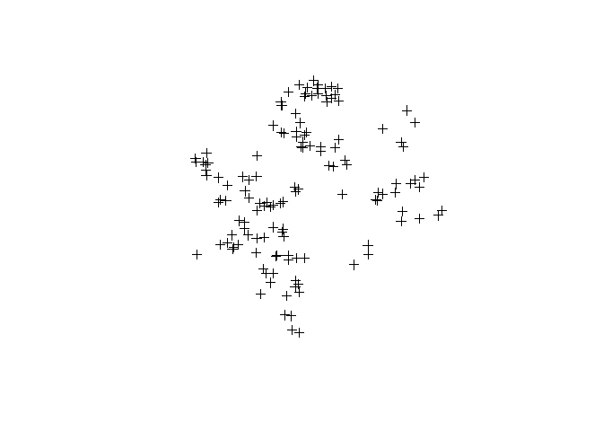

lab5
================
ignacio
February 21, 2017

### 1. Load dataset of home prices and assests from Zillow

    #loading the dataset
    dat <- read.csv( "https://github.com/lecy/hedonic-prices/raw/master/Data/Housing%20Price%20In-Class%20Exercise%20(Responses).csv", stringsAsFactors=FALSE )
    str( dat )

    #fixing some variables
    dat$House.Price <- as.numeric(gsub( ",","", dat$House.Price ))

### 2. Add a census tract FIPS ID to each home (spatial join)

    #cleaning the addresses
    Fadd <- dat$Street.Address.of.House
    Fadd <- gsub( ",","", Fadd ) #deleting comas
    Fadd <- gsub( "\\d{5}$","", Fadd ) #deleting ZIPcodes
    Fadd <- gsub( "Syracuse NY", "", Fadd) #delleting city and state
    Fadd <- gsub( "APT \\d{1,3}", "", Fadd) #delleting aptments
    Fadd <- gsub( "Street", "St", Fadd) #complying to my OCD for names
    Fadd <- gsub( "St.", "St", Fadd) #complying to my OCD for names
    Fadd <- gsub( "\\.", "", Fadd)
    Fadd <- gsub( "\\s{1,}$", "", Fadd) #remove blank spaces at the end
    Fadd <- paste(Fadd, "Syracuse", "NY", sep=", ")

    dat$Fadd <- Fadd #Adding the new addresses to the dataframe

    #Geocoding
    coo <- geocode(Fadd, messaging = F) #geocoding
    dat <- cbind(dat, coo) #binding the geocode with the dataset
    save(dat,file="dat_coo.Rda") #saving theobject to avoid geocoding every time.

Adding the FIPS tract

``` r
load("dat_coo.Rda")
coordinates(dat) = ~lon+lat #making it a coordinates object
plot(dat)
```


``` r
#removing latitudes and lon that are out of the map of syr
syr.min.lon <- -76.25 #x values
syr.max.lon <- -76.05

syr.min.lat <-  42.96 #y values
syr.max.lat <-  43.12


dat <- dat[ dat$lat > syr.min.lat & dat$lat < syr.max.lat , ]
dat <- dat[ dat$lon > syr.min.lon & dat$lon < syr.max.lon , ]

plot(dat)
```



``` r
#creating files: shape file and df
shapes <- readShapePoly(fn="C:\\Users\\icps\\Dropbox\\3. Maxwell\\3. Spring Term\\5. Data Driven II\\Labs\\Instructions\\Lab3_4\\shapefiles\\tl_2010_36067_tract10"
                          ,proj4string=CRS("+proj=longlat +datum=WGS84"))

class(dat)
```

    ## [1] "SpatialPointsDataFrame"
    ## attr(,"package")
    ## [1] "sp"

``` r
class(shapes)
```

    ## [1] "SpatialPolygonsDataFrame"
    ## attr(,"package")
    ## [1] "sp"

``` r
plot(shapes)
  points(dat, pch=20)
```


``` r
plot(shapes
     , xlim=c(syr.min.lon, syr.max.lon)
     , ylim=c(syr.min.lat, syr.max.lat) ) 
  points(dat, pch=20)
```


``` r
#i dont know what this means, but dat and shapes proj4strings must be the same
#look at: http://r-sig-geo.2731867.n2.nabble.com/point-in-polygon-or-over-help-td7583635.html
proj4string(dat)
```

    ## [1] NA

``` r
proj4string(shapes)
```

    ## [1] "+proj=longlat +datum=WGS84"

``` r
proj4string(dat) <- CRS("+proj=longlat +datum=WGS84") 

#Points in poly
pp <- point.in.poly( dat, shapes )
#head(pp@data)
#dim(pp@data)
#dim(dat@data)

#looking at how many points in each poly
x <- tapply(pp@data$Fadd, pp@data$TRACTCE10, FUN=length)
x <- x[is.na(x) == F]
x <- as.data.frame(x)

x
```

    ##         x
    ## 000100  1
    ## 000200  4
    ## 000300  9
    ## 000400  8
    ## 000501  6
    ## 000600  5
    ## 001000  2
    ## 001400  5
    ## 001500  4
    ## 001600  2
    ## 001702  1
    ## 001800  1
    ## 001900  1
    ## 002000  7
    ## 002101  3
    ## 002400  3
    ## 002700  3
    ## 002901  6
    ## 003200  3
    ## 003400  3
    ## 003500  4
    ## 003601  2
    ## 003602  4
    ## 003800  3
    ## 004000 10
    ## 004600  7
    ## 004800  5
    ## 004900  3
    ## 005000  4
    ## 005100  4
    ## 005200  4
    ## 005400  1
    ## 005601  3
    ## 005700  5
    ## 005800  5
    ## 006000  4
    ## 014200  1

``` r
sum(x$x) #146 points!
```

    ## [1] 146

``` r
#average price per census tract
x <- tapply(pp@data$House.Price, pp@data$TRACTCE10, FUN=mean)
x <- x[is.na.data.frame(x) == F]
x <- as.data.frame(x)
```

### 3. Add census data to each home

### 4. Aggregate crimes by census tract(spatial join) and add to the dataset.

Lab6
----

### 1. Create a map of property values in Buffalo

### 2. Create a map of the change in property values
