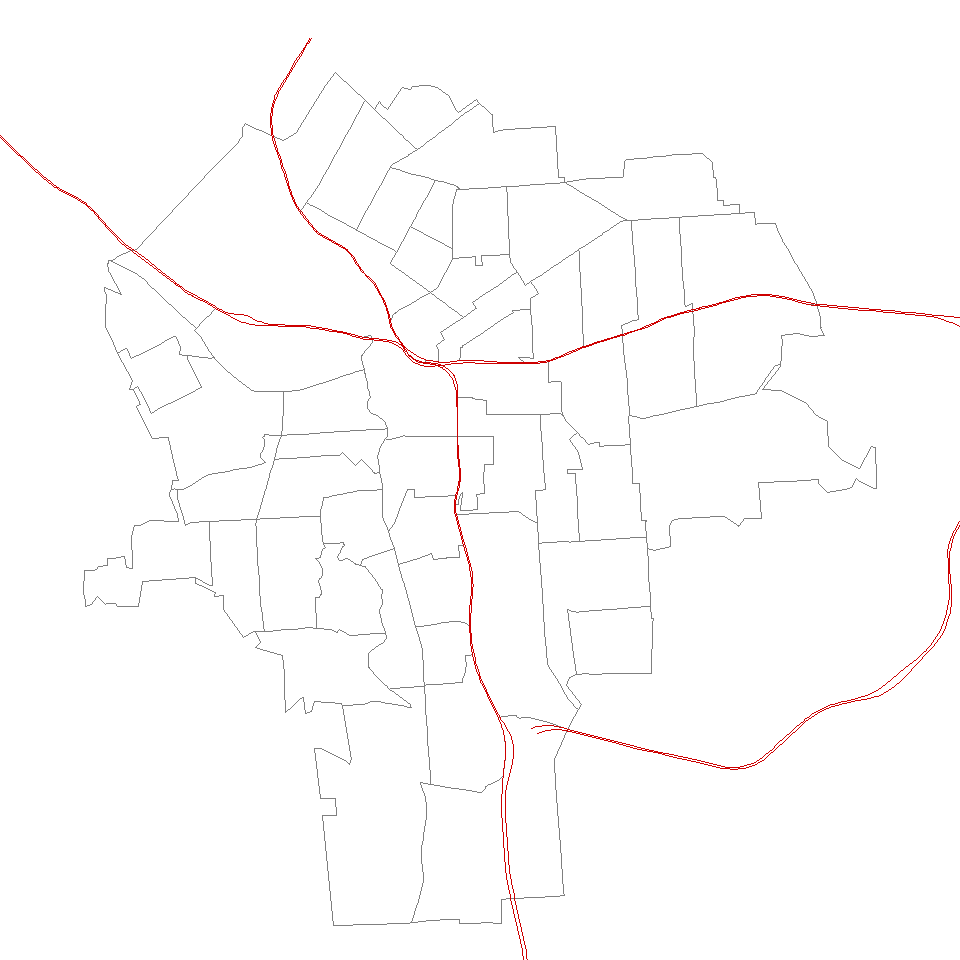
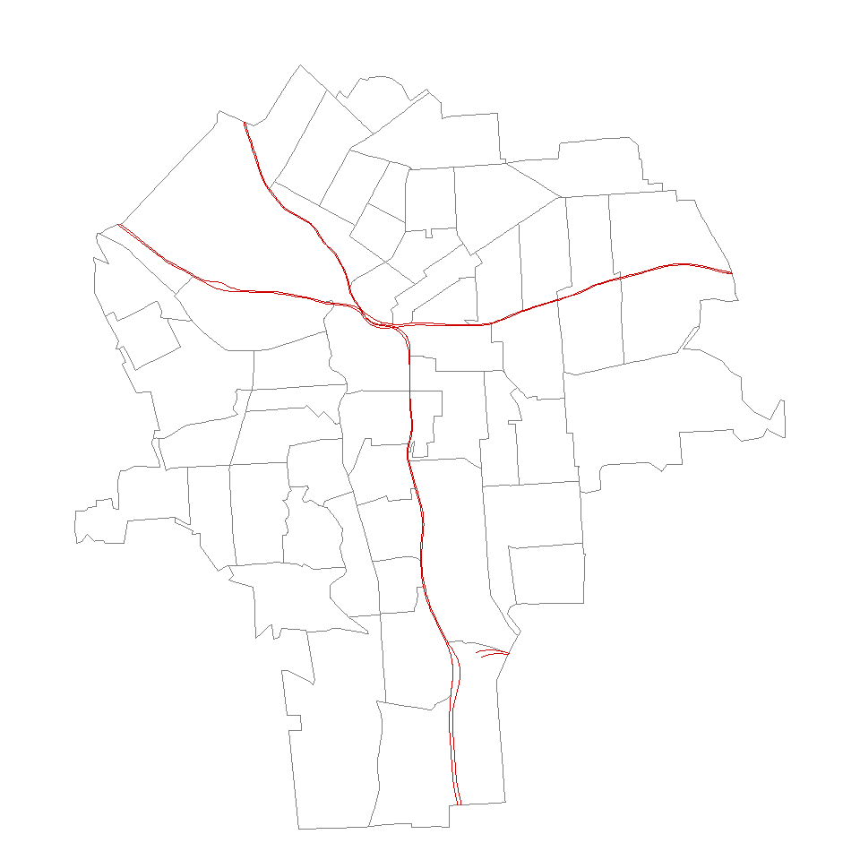
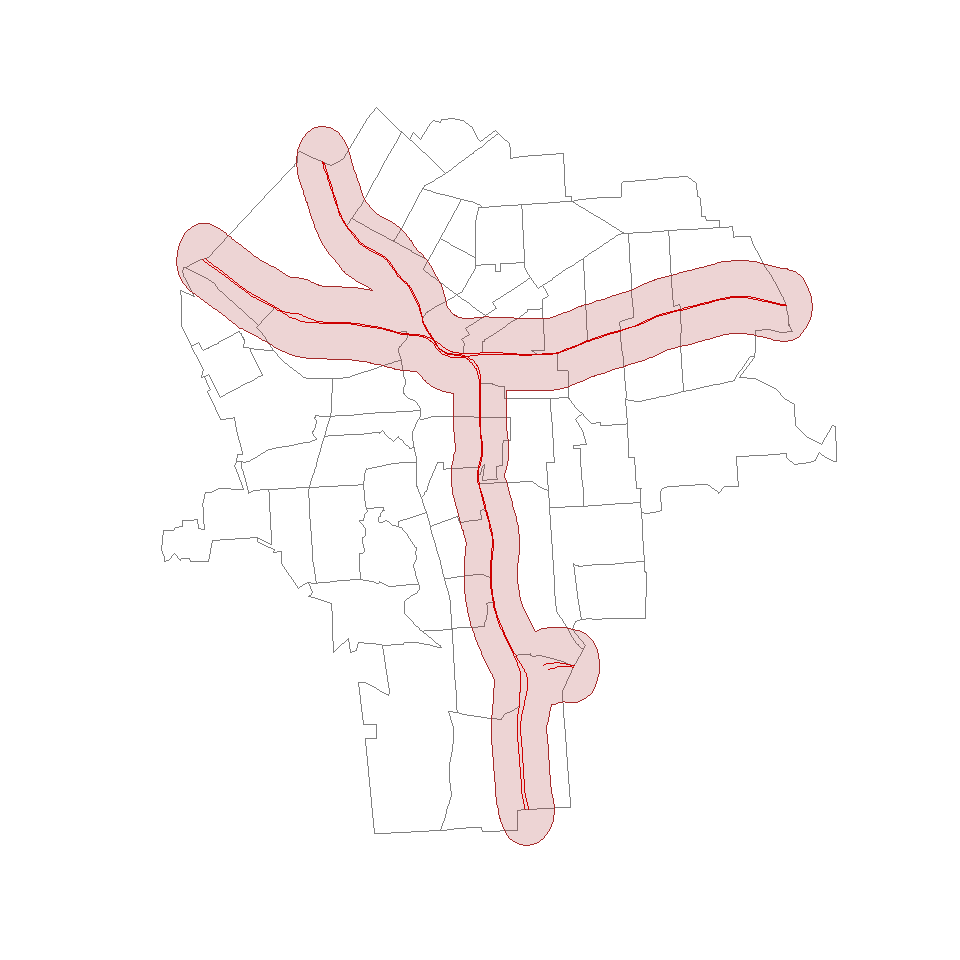
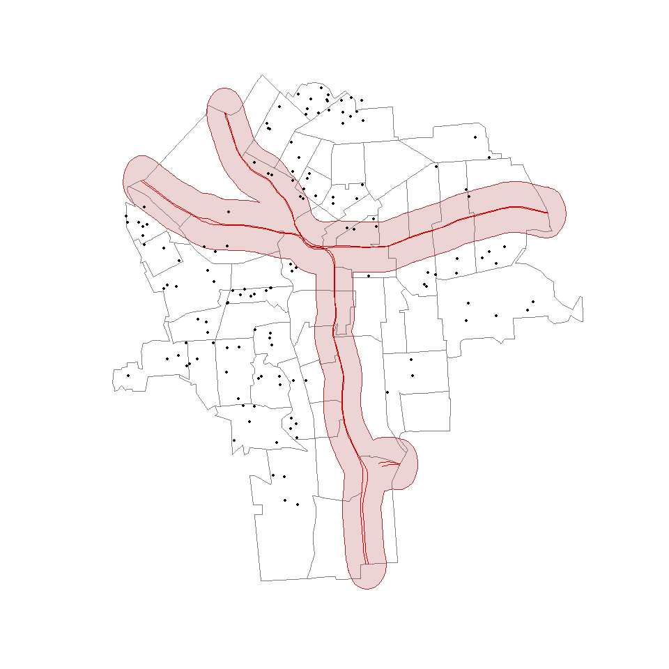
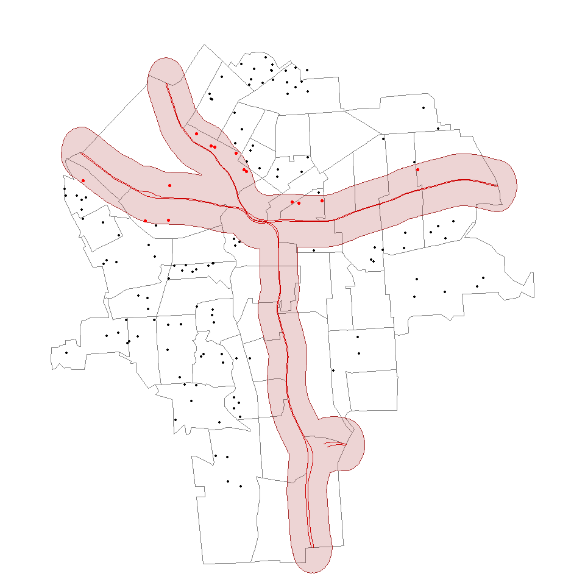
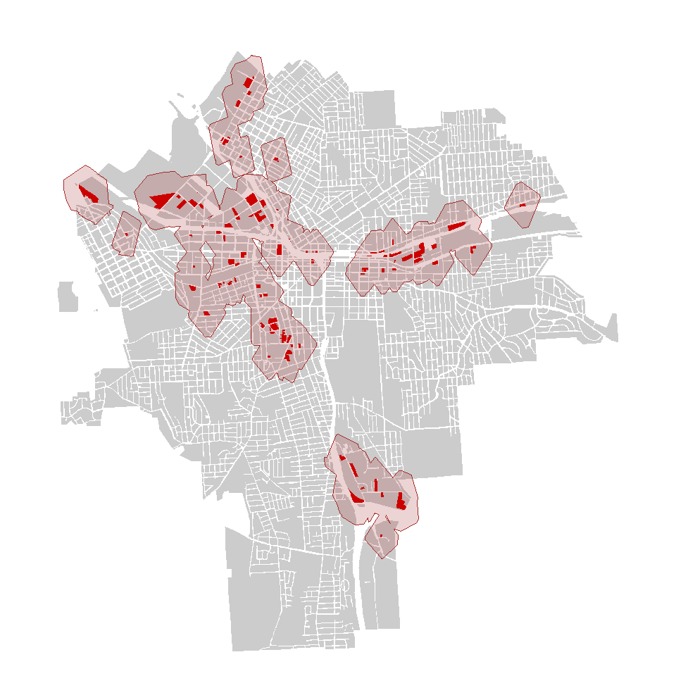
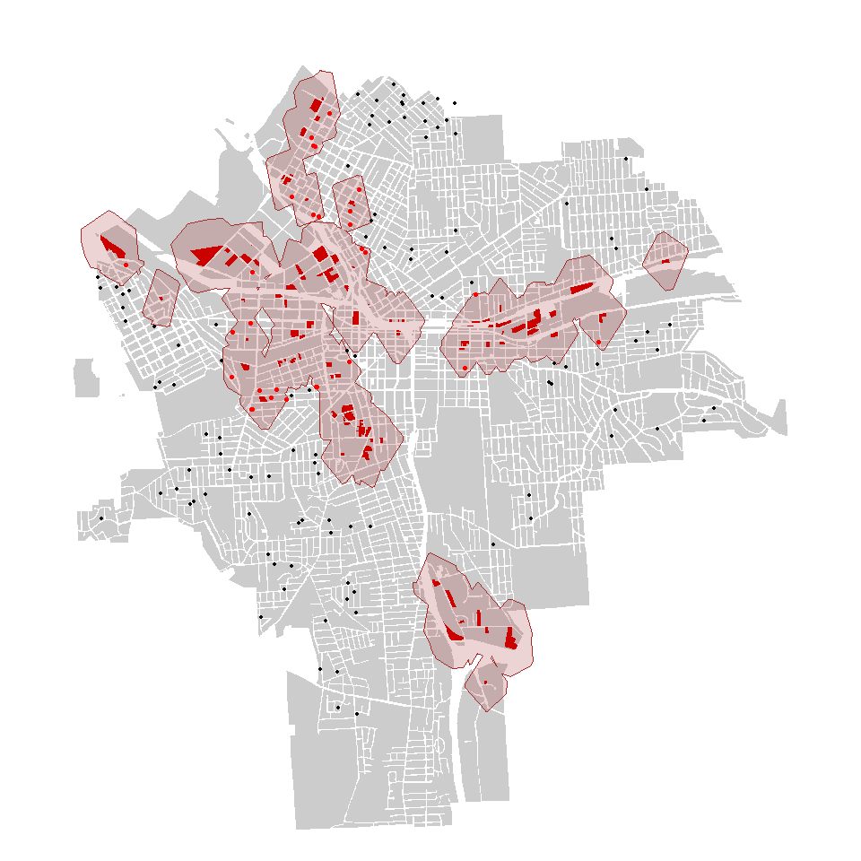
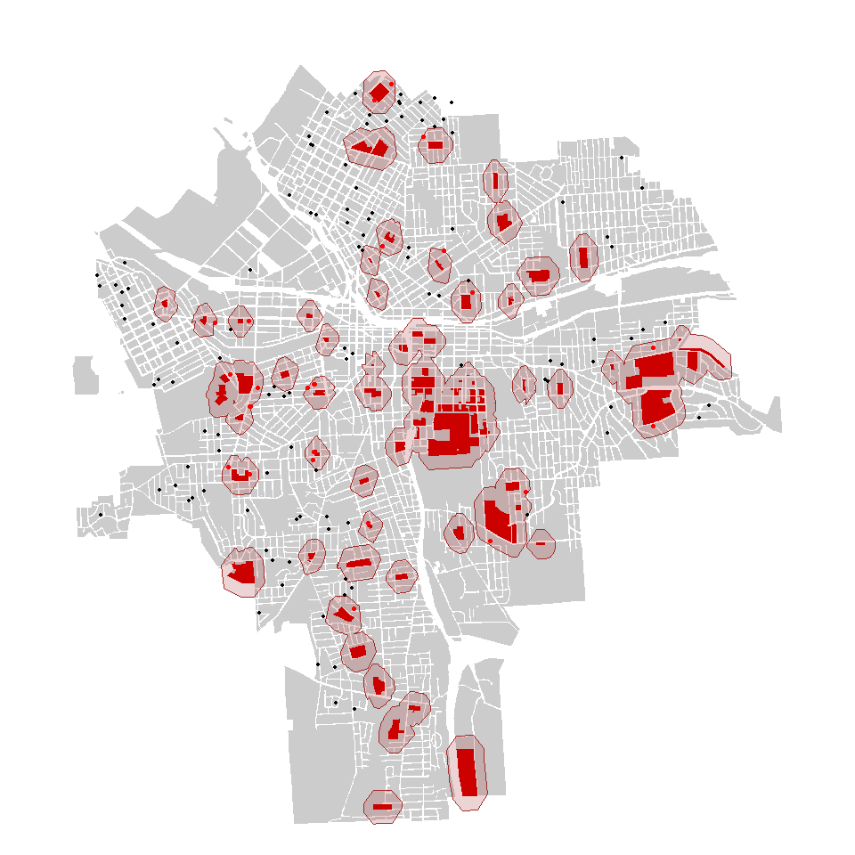

Lab6
================
ignacio
March 23, 2017

### PART I

(1-3) Loading shapefiles and extracting interstates and clipping it to the map polygon size.

``` r
#loading shapefile from file
shapes <- readShapePoly( fn="./shapefiles/tl_2010_36067_tract10", proj4string=CRS("+proj=longlat +datum=WGS84") )
shapes@data <- data.frame(Tract = shapes@data$NAME10)
shapes <- shapes[as.numeric(as.character(shapes$Tract)) < 64, ] #Cutting all tracks that are not in syracuse. lower than 64 gets this.

#getting roads
roads <- readShapeLines( fn="./shapefiles/tl_2015_36_prisecroads", proj4string=CRS("+proj=longlat +datum=WGS84") )

#getting interstate in a separate object
interstate <- roads[ roads$RTTYP == "I" , ]

#plotting map and interstate
par(mar=c(0,0,2,0))
plot(shapes,  border="gray50")
plot(interstate, col="red3", lwd=1, add=T)
```



``` r
#clipping roads to the shape file
interstate <- gIntersection(shapes, interstate)
#this is an alternative function: 
#roads.cropped <- intersect(interstate, shapes)

plot(shapes,  border="gray50")
plot(interstate, col="red3", lwd=1, add=T)
```



1.  Create a buffer of approximately a quarter mile (eyeball this) from the interstate

``` r
buffer <- gBuffer(interstate, width = .005)

plot(shapes,  border="gray50")
plot(buffer, border="brown", col = adjustcolor("brown", alpha.f = .2),lwd=1, add=T)
plot(interstate, col="red3", lwd=1, add=T)
```



``` r
#uploading the dataset of houses that was geocoded in lab 5

setwd("C:/Users/icps/Dropbox/3. Maxwell/3. Spring Term/5. Data Driven II/Labs/all-labs-ddmii-icps86/Lab5/")
load("dat_coo.rda") #I has stored it as a rda file.
setwd("C:/Users/icps/Dropbox/3. Maxwell/3. Spring Term/5. Data Driven II/Labs/all-labs-ddmii-icps86/Lab6/")

# Convert the coordinates that are in lon (x) lat(y) order to spatial points, identifying the coordinates, data, and coordinate system

coo <- dat[ ,c( "lon", "lat") ] #extracting the coordinates
#making binding coordinates (coo) and data (dat) as a spatial object. Notice that dat maintains the lat lon variables as data
dat <- SpatialPointsDataFrame(coo, dat, proj4string=CRS("+proj=longlat +datum=WGS84"))

#plotting 
plot(shapes,  border="gray50")
plot(buffer, border="brown", col = adjustcolor("brown", alpha.f = .2),lwd=1, add=T)
plot(interstate, col="red3", lwd=1, add=T)
plot(dat, pch = 20, cex=.8, add=T)
```



1.  Add a new categorical variable to the houses dataset that indicates whether it falls within the buffer zone or not.

``` r
#Over function to determine what points are within the buffer
x <- over( dat, buffer ) #outputs a dummy variable

dat@data$hgwy <- x

#plotting 
par(mar=c(0,0,2,0))
plot(shapes,  border="gray50")
plot(buffer, border="brown", col = adjustcolor("brown", alpha.f = .2),lwd=1, add=T)
plot(interstate, col="red3", lwd=1, add=T)
plot(dat, pch = 20, cex=.8, add=T)
plot(dat[!is.na(dat$hgwy),], pch = 20, col = "red", cex=1, add=T)
```



### PART II

Using the Syracuse parcel file for this part.

1.  Create a buffer a quarter mile from industrial zones (LandUse). Create a plot to highlight your buffer zone.

``` r
url <- "https://raw.githubusercontent.com/lecy/geojson/master/syr_parcels.geojson"

shapes <- geojson_read( url, method="local", what="sp" )

#subsetting industrialzones
industrial <- shapes[ shapes$LandUse == "Industrial", ]

#Creating buffer next to industrial zones
buffer <- gBuffer( industrial,  
                   width = 0.003621,
                   capStyle = "FLAT",
                   quadsegs = 1,
                   byid = FALSE
                   )
#plotting
par(mar=c(0,0,2,0))
plot(shapes,  col="gray80", border = FALSE)
plot(buffer, border="brown", col = adjustcolor("brown", alpha.f = .2),lwd=1, add=T)
plot(industrial,  col= "red3", border = FALSE, add=T)
```



1.  Identify houses within the buffer zone and create a categorical variable in the dataset indicating proximity to industrial zones.

``` r
#need to make CRS in both buffer and dat =. there are two ways
proj4string(dat)
```

    ## [1] "+proj=longlat +datum=WGS84 +ellps=WGS84 +towgs84=0,0,0"

``` r
proj4string(buffer)
```

    ## [1] "+proj=longlat +ellps=WGS84 +towgs84=0,0,0,0,0,0,0 +no_defs"

``` r
#loading again the dat and using the new CRS
#setwd("C:/Users/icps/Dropbox/3. Maxwell/3. Spring Term/5. Data Driven II/Labs/all-labs-ddmii-icps86/Lab5/")
#load("dat_coo.rda") #I has stored it as a rda file.
#setwd("C:/Users/icps/Dropbox/3. Maxwell/3. Spring Term/5. Data Driven II/Labs/all-labs-ddmii-icps86/Lab6/")
#coo <- dat[ ,c( "lon", "lat") ] #extracting the coordinates
#dat <- SpatialPointsDataFrame(coo, dat, proj4string=CRS("+proj=longlat +ellps=WGS84 +towgs84=0,0,0,0,0,0,0 +no_defs"))

#OR, transforming the buffer - NOTE: does not work to overwrite the CRS with the code:
#proj4string(dat) <- CRS("+proj=longlat +datum=WGS84") 
#need to use sptransform:

buffer <- spTransform( buffer, CRS( "+proj=longlat +datum=WGS84" ) )

#now they are equal
proj4string(dat)
```

    ## [1] "+proj=longlat +datum=WGS84 +ellps=WGS84 +towgs84=0,0,0"

``` r
proj4string(buffer)
```

    ## [1] "+proj=longlat +datum=WGS84 +ellps=WGS84 +towgs84=0,0,0"

``` r
#Over function to determine what points are within the buffer
x <- over( dat, buffer ) #outputs a dummy variable
dat@data$indst <- x

#plotting the houses
par(mar=c(0,0,2,0))
plot(shapes,  col="gray80", border = FALSE)
plot(buffer, border="brown", col = adjustcolor("brown", alpha.f = .2),lwd=1, add=T)
plot(industrial,  col= "red3", border = FALSE, add=T)
plot(dat, pch = 20, cex=.8, add=T)
plot(dat[!is.na(dat$indst),], pch = 20, col = "red", cex=1, add=T)
```



(3-4) Create a buffer zone an eighth of a mile from schools and identifying houses within the buffer zone and create a categorical variable in the dataset indicating proximity to schools.

``` r
#subsetting industrialzones
schools <- shapes[ shapes$LandUse == "Schools", ]

#Creating buffer next to industrial zones
buffer <- gBuffer( schools,  
                   width = 0.0018105,
                   capStyle = "FLAT",
                   quadsegs = 1,
                   byid = FALSE
                   )
#plotting
par(mar=c(0,0,2,0))
plot(shapes,  col="gray80", border = FALSE)
plot(buffer, border="brown", col = adjustcolor("brown", alpha.f = .2),lwd=1, add=T)
plot(schools,  col= "red3", border = FALSE, add=T)

#making buffer share same CRS
buffer <- spTransform( buffer, CRS( "+proj=longlat +datum=WGS84" ) )

#Over function to determine what points are within the buffer
x <- over( dat, buffer ) #outputs a dummy variable
dat@data$school <- x

#plotting the houses
plot(dat, pch = 20, cex=.8, add=T)
plot(dat[!is.na(dat$school),], pch = 20, col = "red", cex=1, add=T)
```


