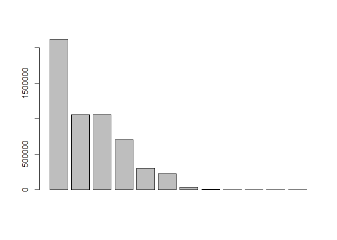
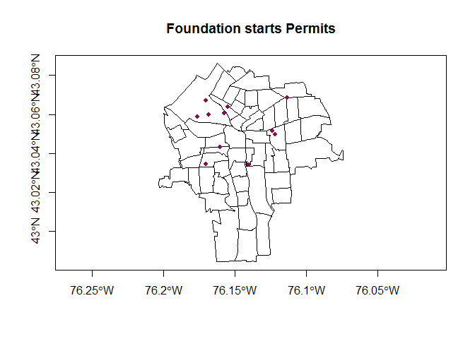
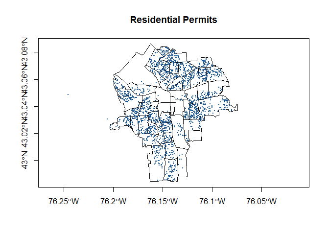
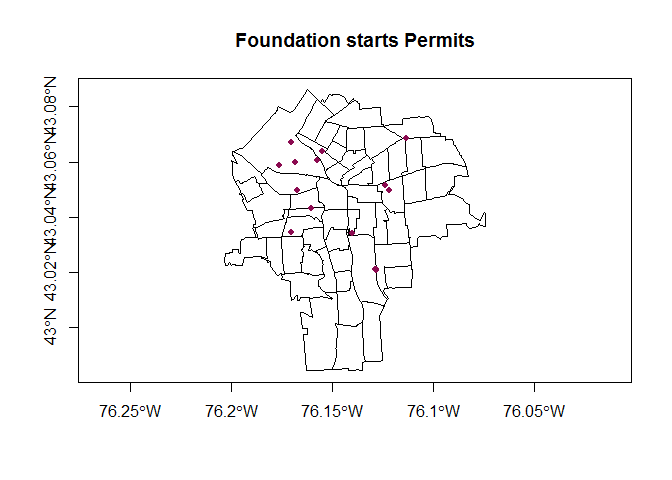
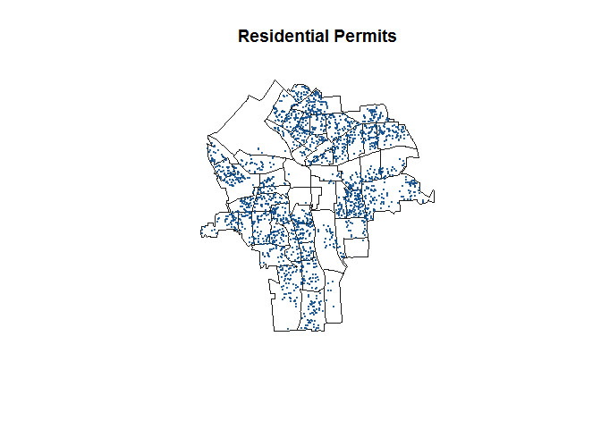

Permits and ED
================
ignacio
March 30, 2017

### PROPOSED INDICATORS

### **1.New Foundations starts (Found)**

<table style="width:90%;">
<colgroup>
<col width="12%" />
<col width="29%" />
<col width="9%" />
<col width="13%" />
<col width="12%" />
<col width="12%" />
</colgroup>
<thead>
<tr class="header">
<th align="center"> </th>
<th align="center">type</th>
<th align="center">freq</th>
<th align="center">meanval</th>
<th align="center">minval</th>
<th align="center">maxval</th>
</tr>
</thead>
<tbody>
<tr class="odd">
<td align="center"><strong>15</strong></td>
<td align="center">Footing / Foundation</td>
<td align="center">16</td>
<td align="center">353372</td>
<td align="center">0</td>
<td align="center">2116550</td>
</tr>
</tbody>
</table>

<table style="width:49%;">
<colgroup>
<col width="9%" />
<col width="9%" />
<col width="9%" />
<col width="9%" />
<col width="9%" />
</colgroup>
<thead>
<tr class="header">
<th align="center">2012</th>
<th align="center">2013</th>
<th align="center">2014</th>
<th align="center">2015</th>
<th align="center">2016</th>
</tr>
</thead>
<tbody>
<tr class="odd">
<td align="center">5</td>
<td align="center">2</td>
<td align="center">1</td>
<td align="center">3</td>
<td align="center">1</td>
</tr>
</tbody>
</table>

<table style="width:69%;">
<colgroup>
<col width="9%" />
<col width="13%" />
<col width="12%" />
<col width="9%" />
<col width="13%" />
<col width="9%" />
</colgroup>
<thead>
<tr class="header">
<th align="center">Min.</th>
<th align="center">1st Qu.</th>
<th align="center">Median</th>
<th align="center">Mean</th>
<th align="center">3rd Qu.</th>
<th align="center">Max.</th>
</tr>
</thead>
<tbody>
<tr class="odd">
<td align="center">0</td>
<td align="center">0</td>
<td align="center">125000</td>
<td align="center">456600</td>
<td align="center">788900</td>
<td align="center">2117000</td>
</tr>
</tbody>
</table>



### **2.New/Reno Residential (Res)**

<table style="width:90%;">
<colgroup>
<col width="12%" />
<col width="29%" />
<col width="9%" />
<col width="13%" />
<col width="12%" />
<col width="12%" />
</colgroup>
<thead>
<tr class="header">
<th align="center"> </th>
<th align="center">type</th>
<th align="center">freq</th>
<th align="center">meanval</th>
<th align="center">minval</th>
<th align="center">maxval</th>
</tr>
</thead>
<tbody>
<tr class="odd">
<td align="center"><strong>23</strong></td>
<td align="center">Res. New 1-2 Family</td>
<td align="center">42</td>
<td align="center">121314</td>
<td align="center">0</td>
<td align="center">255539</td>
</tr>
<tr class="even">
<td align="center"><strong>24</strong></td>
<td align="center">Res. Remodel/Chg Occ</td>
<td align="center">2226</td>
<td align="center">6946</td>
<td align="center">0</td>
<td align="center">360000</td>
</tr>
</tbody>
</table>

<table style="width:49%;">
<colgroup>
<col width="9%" />
<col width="9%" />
<col width="9%" />
<col width="9%" />
<col width="9%" />
</colgroup>
<thead>
<tr class="header">
<th align="center">2012</th>
<th align="center">2013</th>
<th align="center">2014</th>
<th align="center">2015</th>
<th align="center">2016</th>
</tr>
</thead>
<tbody>
<tr class="odd">
<td align="center">278</td>
<td align="center">402</td>
<td align="center">539</td>
<td align="center">583</td>
<td align="center">392</td>
</tr>
</tbody>
</table>

<table style="width:68%;">
<colgroup>
<col width="9%" />
<col width="13%" />
<col width="12%" />
<col width="9%" />
<col width="13%" />
<col width="8%" />
</colgroup>
<thead>
<tr class="header">
<th align="center">Min.</th>
<th align="center">1st Qu.</th>
<th align="center">Median</th>
<th align="center">Mean</th>
<th align="center">3rd Qu.</th>
<th align="center">Max.</th>
</tr>
</thead>
<tbody>
<tr class="odd">
<td align="center">0</td>
<td align="center">1000</td>
<td align="center">3000</td>
<td align="center">8609</td>
<td align="center">9000</td>
<td align="center">360000</td>
</tr>
</tbody>
</table>



### **3.New/Reno Commercial (Com)**

<table style="width:90%;">
<colgroup>
<col width="11%" />
<col width="30%" />
<col width="9%" />
<col width="13%" />
<col width="12%" />
<col width="12%" />
</colgroup>
<thead>
<tr class="header">
<th align="left"> </th>
<th align="center">type</th>
<th align="center">freq</th>
<th align="center">meanval</th>
<th align="center">minval</th>
<th align="center">maxval</th>
</tr>
</thead>
<tbody>
<tr class="odd">
<td align="left"><strong>4</strong></td>
<td align="center">Com. New Building</td>
<td align="center">60</td>
<td align="center">2463186</td>
<td align="center">1500</td>
<td align="center">15183229</td>
</tr>
<tr class="even">
<td align="left"><strong>5</strong></td>
<td align="center">Com. Reno/Rem/Chg Occ</td>
<td align="center">1689</td>
<td align="center">248891</td>
<td align="center">0</td>
<td align="center">31811000</td>
</tr>
</tbody>
</table>

<table style="width:49%;">
<colgroup>
<col width="9%" />
<col width="9%" />
<col width="9%" />
<col width="9%" />
<col width="9%" />
</colgroup>
<thead>
<tr class="header">
<th align="center">2012</th>
<th align="center">2013</th>
<th align="center">2014</th>
<th align="center">2015</th>
<th align="center">2016</th>
</tr>
</thead>
<tbody>
<tr class="odd">
<td align="center">299</td>
<td align="center">209</td>
<td align="center">259</td>
<td align="center">240</td>
<td align="center">230</td>
</tr>
</tbody>
</table>

<table style="width:74%;">
<colgroup>
<col width="9%" />
<col width="13%" />
<col width="12%" />
<col width="9%" />
<col width="13%" />
<col width="13%" />
</colgroup>
<thead>
<tr class="header">
<th align="center">Min.</th>
<th align="center">1st Qu.</th>
<th align="center">Median</th>
<th align="center">Mean</th>
<th align="center">3rd Qu.</th>
<th align="center">Max.</th>
</tr>
</thead>
<tbody>
<tr class="odd">
<td align="center">0</td>
<td align="center">6000</td>
<td align="center">25000</td>
<td align="center">354400</td>
<td align="center">125000</td>
<td align="center">31810000</td>
</tr>
</tbody>
</table>



### **4.Demolitions (Dem)**

<table style="width:75%;">
<colgroup>
<col width="11%" />
<col width="15%" />
<col width="9%" />
<col width="13%" />
<col width="12%" />
<col width="12%" />
</colgroup>
<thead>
<tr class="header">
<th align="left"> </th>
<th align="center">type</th>
<th align="center">freq</th>
<th align="center">meanval</th>
<th align="center">minval</th>
<th align="center">maxval</th>
</tr>
</thead>
<tbody>
<tr class="odd">
<td align="left"><strong>7</strong></td>
<td align="center">Demolition</td>
<td align="center">599</td>
<td align="center">17484</td>
<td align="center">0</td>
<td align="center">3e+05</td>
</tr>
</tbody>
</table>

<table style="width:49%;">
<colgroup>
<col width="9%" />
<col width="9%" />
<col width="9%" />
<col width="9%" />
<col width="9%" />
</colgroup>
<thead>
<tr class="header">
<th align="center">2012</th>
<th align="center">2013</th>
<th align="center">2014</th>
<th align="center">2015</th>
<th align="center">2016</th>
</tr>
</thead>
<tbody>
<tr class="odd">
<td align="center">84</td>
<td align="center">81</td>
<td align="center">116</td>
<td align="center">160</td>
<td align="center">123</td>
</tr>
</tbody>
</table>

<table style="width:68%;">
<colgroup>
<col width="9%" />
<col width="13%" />
<col width="12%" />
<col width="9%" />
<col width="13%" />
<col width="8%" />
</colgroup>
<thead>
<tr class="header">
<th align="center">Min.</th>
<th align="center">1st Qu.</th>
<th align="center">Median</th>
<th align="center">Mean</th>
<th align="center">3rd Qu.</th>
<th align="center">Max.</th>
</tr>
</thead>
<tbody>
<tr class="odd">
<td align="center">0</td>
<td align="center">5900</td>
<td align="center">11370</td>
<td align="center">15840</td>
<td align="center">18000</td>
<td align="center">3e+05</td>
</tr>
</tbody>
</table>


### **5.Installations and Repairs (Ins)**

<table style="width:94%;">
<colgroup>
<col width="12%" />
<col width="33%" />
<col width="9%" />
<col width="13%" />
<col width="12%" />
<col width="12%" />
</colgroup>
<thead>
<tr class="header">
<th align="center"> </th>
<th align="center">type</th>
<th align="center">freq</th>
<th align="center">meanval</th>
<th align="center">minval</th>
<th align="center">maxval</th>
</tr>
</thead>
<tbody>
<tr class="odd">
<td align="center"><strong>1</strong></td>
<td align="center">Antenna / Dish</td>
<td align="center">112</td>
<td align="center">22830</td>
<td align="center">0</td>
<td align="center">80000</td>
</tr>
<tr class="even">
<td align="center"><strong>8</strong></td>
<td align="center">Electric</td>
<td align="center">5807</td>
<td align="center">23839</td>
<td align="center">0</td>
<td align="center">8e+06</td>
</tr>
<tr class="odd">
<td align="center"><strong>9</strong></td>
<td align="center">Electric (Meter Set)</td>
<td align="center">767</td>
<td align="center">288.1</td>
<td align="center">0</td>
<td align="center">14500</td>
</tr>
<tr class="even">
<td align="center"><strong>10</strong></td>
<td align="center">Elevator</td>
<td align="center">172</td>
<td align="center">72456</td>
<td align="center">0</td>
<td align="center">1172000</td>
</tr>
<tr class="odd">
<td align="center"><strong>14</strong></td>
<td align="center">Fire Alarm</td>
<td align="center">616</td>
<td align="center">51750</td>
<td align="center">0</td>
<td align="center">8e+06</td>
</tr>
<tr class="even">
<td align="center"><strong>16</strong></td>
<td align="center">HVAC/Mechanical</td>
<td align="center">2170</td>
<td align="center">52752</td>
<td align="center">0</td>
<td align="center">9764733</td>
</tr>
<tr class="odd">
<td align="center"><strong>19</strong></td>
<td align="center">Misc.(deck, fence,ramp)</td>
<td align="center">1166</td>
<td align="center">5174</td>
<td align="center">0</td>
<td align="center">2100000</td>
</tr>
<tr class="even">
<td align="center"><strong>21</strong></td>
<td align="center">Pool / Hot Tub</td>
<td align="center">71</td>
<td align="center">6721</td>
<td align="center">0</td>
<td align="center">30000</td>
</tr>
<tr class="odd">
<td align="center"><strong>26</strong></td>
<td align="center">Security Alarm</td>
<td align="center">542</td>
<td align="center">1215</td>
<td align="center">0</td>
<td align="center">91968</td>
</tr>
<tr class="even">
<td align="center"><strong>31</strong></td>
<td align="center">Sprinkler</td>
<td align="center">1793</td>
<td align="center">10740</td>
<td align="center">0</td>
<td align="center">1396500</td>
</tr>
<tr class="odd">
<td align="center"><strong>32</strong></td>
<td align="center">Tank</td>
<td align="center">67</td>
<td align="center">17529</td>
<td align="center">0</td>
<td align="center">3e+05</td>
</tr>
</tbody>
</table>

<table style="width:49%;">
<colgroup>
<col width="9%" />
<col width="9%" />
<col width="9%" />
<col width="9%" />
<col width="9%" />
</colgroup>
<thead>
<tr class="header">
<th align="center">2012</th>
<th align="center">2013</th>
<th align="center">2014</th>
<th align="center">2015</th>
<th align="center">2016</th>
</tr>
</thead>
<tbody>
<tr class="odd">
<td align="center">2246</td>
<td align="center">2402</td>
<td align="center">2387</td>
<td align="center">2233</td>
<td align="center">1903</td>
</tr>
</tbody>
</table>

<table style="width:68%;">
<colgroup>
<col width="9%" />
<col width="13%" />
<col width="12%" />
<col width="9%" />
<col width="13%" />
<col width="8%" />
</colgroup>
<thead>
<tr class="header">
<th align="center">Min.</th>
<th align="center">1st Qu.</th>
<th align="center">Median</th>
<th align="center">Mean</th>
<th align="center">3rd Qu.</th>
<th align="center">Max.</th>
</tr>
</thead>
<tbody>
<tr class="odd">
<td align="center">0</td>
<td align="center">700</td>
<td align="center">2000</td>
<td align="center">20060</td>
<td align="center">6000</td>
<td align="center">8e+06</td>
</tr>
</tbody>
</table>



### **Ignored (Ign)**

<table style="width:97%;">
<colgroup>
<col width="12%" />
<col width="36%" />
<col width="9%" />
<col width="13%" />
<col width="12%" />
<col width="12%" />
</colgroup>
<thead>
<tr class="header">
<th align="center"> </th>
<th align="center">type</th>
<th align="center">freq</th>
<th align="center">meanval</th>
<th align="center">minval</th>
<th align="center">maxval</th>
</tr>
</thead>
<tbody>
<tr class="odd">
<td align="center"><strong>2</strong></td>
<td align="center">Block Party (Business)</td>
<td align="center">157</td>
<td align="center">0</td>
<td align="center">0</td>
<td align="center">0</td>
</tr>
<tr class="even">
<td align="center"><strong>3</strong></td>
<td align="center">Block Party (Residential)</td>
<td align="center">149</td>
<td align="center">0</td>
<td align="center">0</td>
<td align="center">0</td>
</tr>
<tr class="odd">
<td align="center"><strong>6</strong></td>
<td align="center">Curb Cut</td>
<td align="center">62</td>
<td align="center">0</td>
<td align="center">0</td>
<td align="center">0</td>
</tr>
<tr class="even">
<td align="center"><strong>11</strong></td>
<td align="center">Encroach (Deminimus)</td>
<td align="center">5</td>
<td align="center">0</td>
<td align="center">0</td>
<td align="center">0</td>
</tr>
<tr class="odd">
<td align="center"><strong>12</strong></td>
<td align="center">Encroach (Major)</td>
<td align="center">37</td>
<td align="center">0</td>
<td align="center">0</td>
<td align="center">0</td>
</tr>
<tr class="even">
<td align="center"><strong>13</strong></td>
<td align="center">Encroachment (Converted)</td>
<td align="center">29</td>
<td align="center">0</td>
<td align="center">0</td>
<td align="center">0</td>
</tr>
<tr class="odd">
<td align="center"><strong>17</strong></td>
<td align="center">Liability Waiver</td>
<td align="center">598</td>
<td align="center">0</td>
<td align="center">0</td>
<td align="center">0</td>
</tr>
<tr class="even">
<td align="center"><strong>18</strong></td>
<td align="center">Loading Zone (Business)</td>
<td align="center">175</td>
<td align="center">0</td>
<td align="center">0</td>
<td align="center">0</td>
</tr>
<tr class="odd">
<td align="center"><strong>20</strong></td>
<td align="center">Parking Meter Rental</td>
<td align="center">111</td>
<td align="center">0</td>
<td align="center">0</td>
<td align="center">0</td>
</tr>
<tr class="even">
<td align="center"><strong>22</strong></td>
<td align="center">Public Assembly</td>
<td align="center">172</td>
<td align="center">0</td>
<td align="center">0</td>
<td align="center">0</td>
</tr>
<tr class="odd">
<td align="center"><strong>25</strong></td>
<td align="center">Road Cut</td>
<td align="center">595</td>
<td align="center">0</td>
<td align="center">0</td>
<td align="center">0</td>
</tr>
<tr class="even">
<td align="center"><strong>27</strong></td>
<td align="center">Sidewalk Cafe</td>
<td align="center">236</td>
<td align="center">0</td>
<td align="center">0</td>
<td align="center">0</td>
</tr>
<tr class="odd">
<td align="center"><strong>28</strong></td>
<td align="center">Sidewalk Replace</td>
<td align="center">773</td>
<td align="center">0</td>
<td align="center">0</td>
<td align="center">0</td>
</tr>
<tr class="even">
<td align="center"><strong>29</strong></td>
<td align="center">Sign</td>
<td align="center">328</td>
<td align="center">6879</td>
<td align="center">0</td>
<td align="center">143000</td>
</tr>
<tr class="odd">
<td align="center"><strong>30</strong></td>
<td align="center">Site Work</td>
<td align="center">214</td>
<td align="center">264969</td>
<td align="center">0</td>
<td align="center">7400000</td>
</tr>
</tbody>
</table>

<table style="width:49%;">
<colgroup>
<col width="9%" />
<col width="9%" />
<col width="9%" />
<col width="9%" />
<col width="9%" />
</colgroup>
<thead>
<tr class="header">
<th align="center">2012</th>
<th align="center">2013</th>
<th align="center">2014</th>
<th align="center">2015</th>
<th align="center">2016</th>
</tr>
</thead>
<tbody>
<tr class="odd">
<td align="center">513</td>
<td align="center">655</td>
<td align="center">739</td>
<td align="center">801</td>
<td align="center">930</td>
</tr>
</tbody>
</table>

    ## [1] "total cases: 3641"

<table style="width:69%;">
<colgroup>
<col width="9%" />
<col width="13%" />
<col width="12%" />
<col width="9%" />
<col width="13%" />
<col width="9%" />
</colgroup>
<thead>
<tr class="header">
<th align="center">Min.</th>
<th align="center">1st Qu.</th>
<th align="center">Median</th>
<th align="center">Mean</th>
<th align="center">3rd Qu.</th>
<th align="center">Max.</th>
</tr>
</thead>
<tbody>
<tr class="odd">
<td align="center">0</td>
<td align="center">0</td>
<td align="center">0</td>
<td align="center">16190</td>
<td align="center">0</td>
<td align="center">7400000</td>
</tr>
</tbody>
</table>


### **All together**

``` r
plot(shapes
     , axes = T
     ) 
  title(main = "All points")
  points(df.I, pch=20, cex= .2, col=adjustcolor("gold1", alpha.f = .6))
  points(df.C, pch=20, cex= .2, col=adjustcolor("firebrick", alpha.f = .5))
  points(df.R, pch=20, cex = .4, col=adjustcolor("dodgerblue4", alpha.f = .5))
  points(df.D, pch=20, cex = .4, col=adjustcolor("deeppink4", alpha.f = 7))
  points(df.F, pch=20, cex= 1.2, col=adjustcolor("forestgreen", alpha.f = 1))
```


### NAs in the data per variables

<table style="width:24%;">
<colgroup>
<col width="16%" />
<col width="6%" />
</colgroup>
<thead>
<tr class="header">
<th align="center">variable</th>
<th align="center">NAs</th>
</tr>
</thead>
<tbody>
<tr class="odd">
<td align="center">Foundations</td>
<td align="center">4</td>
</tr>
<tr class="even">
<td align="center">Residential</td>
<td align="center">73</td>
</tr>
<tr class="odd">
<td align="center">Comercial</td>
<td align="center">504</td>
</tr>
<tr class="even">
<td align="center">Demolition</td>
<td align="center">35</td>
</tr>
<tr class="odd">
<td align="center">Int and Rep</td>
<td align="center">2095</td>
</tr>
<tr class="even">
<td align="center">Ignored</td>
<td align="center">0</td>
</tr>
</tbody>
</table>
