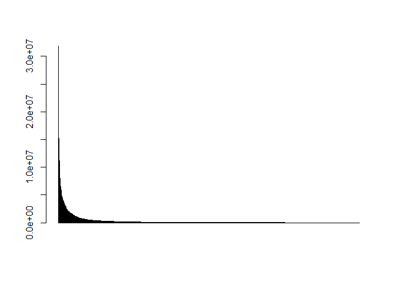
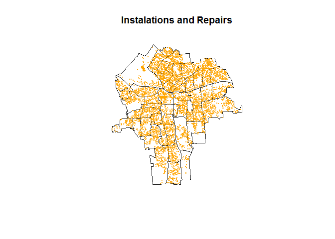
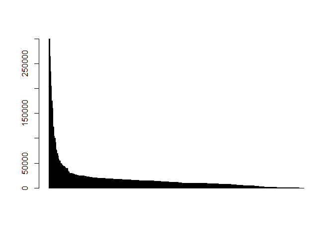

Permits
================
ignacio
March 30, 2017

Information about the Dataset
-----------------------------

The Permits Dataset has information for 21,556 permits from 2012 - 2013. For each permit the Dataset inclueds variables like: \* Type of Permit \* Applicant name (can be either a person or a company) \* Location \* SBL \* Date Issued \* Valuation (cost of the activity the applicant is requesting permit for) \* Fee Amount (the monies for the City)

We used the types of permits to construct 4 categories that we will aggregate as variables at the Census Tract level.

There are 32 types of permits:

    ##  [1] "Antenna / Dish"            "Block Party (Business)"   
    ##  [3] "Block Party (Residential)" "Com. New Building"        
    ##  [5] "Com. Reno/Rem/Chg Occ"     "Curb Cut"                 
    ##  [7] "Demolition"                "Electric"                 
    ##  [9] "Electric (Meter Set)"      "Elevator"                 
    ## [11] "Encroach (Deminimus)"      "Encroach (Major)"         
    ## [13] "Encroachment (Converted)"  "Fire Alarm"               
    ## [15] "Footing / Foundation"      "HVAC/Mechanical"          
    ## [17] "Liability Waiver"          "Loading Zone (Business)"  
    ## [19] "Misc.(deck, fence,ramp)"   "Parking Meter Rental"     
    ## [21] "Pool / Hot Tub"            "Public Assembly"          
    ## [23] "Res. New 1-2 Family"       "Res. Remodel/Chg Occ"     
    ## [25] "Road Cut"                  "Security Alarm"           
    ## [27] "Sidewalk Cafe"             "Sidewalk Replace"         
    ## [29] "Sign"                      "Site Work"                
    ## [31] "Sprinkler"                 "Tank"

We have placed this types of Permits into 4 categories to analyze them separately. They are: \* Residential Properties \* Commercial Properties \* Installations and Repairs (to public space, res and com) \* Demolitions

In what follows we explain the categories that we have constructed and show some descriptives.

### PROPOSED VARIABLES

#### **1.New/Reno of Residential Property**

<table style="width:90%;">
<colgroup>
<col width="12%" />
<col width="29%" />
<col width="9%" />
<col width="13%" />
<col width="12%" />
<col width="12%" />
</colgroup>
<thead>
<tr class="header">
<th align="center"> </th>
<th align="center">type</th>
<th align="center">freq</th>
<th align="center">meanval</th>
<th align="center">minval</th>
<th align="center">maxval</th>
</tr>
</thead>
<tbody>
<tr class="odd">
<td align="center"><strong>23</strong></td>
<td align="center">Res. New 1-2 Family</td>
<td align="center">42</td>
<td align="center">121314</td>
<td align="center">0</td>
<td align="center">255539</td>
</tr>
<tr class="even">
<td align="center"><strong>24</strong></td>
<td align="center">Res. Remodel/Chg Occ</td>
<td align="center">2226</td>
<td align="center">6946</td>
<td align="center">0</td>
<td align="center">360000</td>
</tr>
</tbody>
</table>

<table style="width:49%;">
<colgroup>
<col width="9%" />
<col width="9%" />
<col width="9%" />
<col width="9%" />
<col width="9%" />
</colgroup>
<thead>
<tr class="header">
<th align="center">2012</th>
<th align="center">2013</th>
<th align="center">2014</th>
<th align="center">2015</th>
<th align="center">2016</th>
</tr>
</thead>
<tbody>
<tr class="odd">
<td align="center">279</td>
<td align="center">410</td>
<td align="center">565</td>
<td align="center">598</td>
<td align="center">404</td>
</tr>
</tbody>
</table>

<table style="width:68%;">
<colgroup>
<col width="9%" />
<col width="13%" />
<col width="12%" />
<col width="9%" />
<col width="13%" />
<col width="8%" />
</colgroup>
<thead>
<tr class="header">
<th align="center">Min.</th>
<th align="center">1st Qu.</th>
<th align="center">Median</th>
<th align="center">Mean</th>
<th align="center">3rd Qu.</th>
<th align="center">Max.</th>
</tr>
</thead>
<tbody>
<tr class="odd">
<td align="center">0</td>
<td align="center">1000</td>
<td align="center">3000</td>
<td align="center">9046</td>
<td align="center">9000</td>
<td align="center">360000</td>
</tr>
</tbody>
</table>

### **2.New/Reno of Commercial Property**

<table style="width:90%;">
<colgroup>
<col width="11%" />
<col width="30%" />
<col width="9%" />
<col width="13%" />
<col width="12%" />
<col width="12%" />
</colgroup>
<thead>
<tr class="header">
<th align="left"> </th>
<th align="center">type</th>
<th align="center">freq</th>
<th align="center">meanval</th>
<th align="center">minval</th>
<th align="center">maxval</th>
</tr>
</thead>
<tbody>
<tr class="odd">
<td align="left"><strong>4</strong></td>
<td align="center">Com. New Building</td>
<td align="center">60</td>
<td align="center">2463186</td>
<td align="center">1500</td>
<td align="center">15183229</td>
</tr>
<tr class="even">
<td align="left"><strong>5</strong></td>
<td align="center">Com. Reno/Rem/Chg Occ</td>
<td align="center">1689</td>
<td align="center">248891</td>
<td align="center">0</td>
<td align="center">31811000</td>
</tr>
</tbody>
</table>

<table style="width:49%;">
<colgroup>
<col width="9%" />
<col width="9%" />
<col width="9%" />
<col width="9%" />
<col width="9%" />
</colgroup>
<thead>
<tr class="header">
<th align="center">2012</th>
<th align="center">2013</th>
<th align="center">2014</th>
<th align="center">2015</th>
<th align="center">2016</th>
</tr>
</thead>
<tbody>
<tr class="odd">
<td align="center">382</td>
<td align="center">317</td>
<td align="center">327</td>
<td align="center">364</td>
<td align="center">318</td>
</tr>
</tbody>
</table>

<table style="width:74%;">
<colgroup>
<col width="9%" />
<col width="13%" />
<col width="12%" />
<col width="9%" />
<col width="13%" />
<col width="13%" />
</colgroup>
<thead>
<tr class="header">
<th align="center">Min.</th>
<th align="center">1st Qu.</th>
<th align="center">Median</th>
<th align="center">Mean</th>
<th align="center">3rd Qu.</th>
<th align="center">Max.</th>
</tr>
</thead>
<tbody>
<tr class="odd">
<td align="center">0</td>
<td align="center">8500</td>
<td align="center">34000</td>
<td align="center">319500</td>
<td align="center">132400</td>
<td align="center">31810000</td>
</tr>
</tbody>
</table>

### **3.Installations and Repairs on all properties**

\*At the end of this page each type of permit that makes up this category is plotted.

<table style="width:94%;">
<colgroup>
<col width="12%" />
<col width="33%" />
<col width="9%" />
<col width="13%" />
<col width="12%" />
<col width="12%" />
</colgroup>
<thead>
<tr class="header">
<th align="center"> </th>
<th align="center">type</th>
<th align="center">freq</th>
<th align="center">meanval</th>
<th align="center">minval</th>
<th align="center">maxval</th>
</tr>
</thead>
<tbody>
<tr class="odd">
<td align="center"><strong>8</strong></td>
<td align="center">Electric</td>
<td align="center">5807</td>
<td align="center">23839</td>
<td align="center">0</td>
<td align="center">8e+06</td>
</tr>
<tr class="even">
<td align="center"><strong>10</strong></td>
<td align="center">Elevator</td>
<td align="center">172</td>
<td align="center">72456</td>
<td align="center">0</td>
<td align="center">1172000</td>
</tr>
<tr class="odd">
<td align="center"><strong>14</strong></td>
<td align="center">Fire Alarm</td>
<td align="center">616</td>
<td align="center">51750</td>
<td align="center">0</td>
<td align="center">8e+06</td>
</tr>
<tr class="even">
<td align="center"><strong>16</strong></td>
<td align="center">HVAC/Mechanical</td>
<td align="center">2170</td>
<td align="center">52752</td>
<td align="center">0</td>
<td align="center">9764733</td>
</tr>
<tr class="odd">
<td align="center"><strong>19</strong></td>
<td align="center">Misc.(deck, fence,ramp)</td>
<td align="center">1166</td>
<td align="center">5174</td>
<td align="center">0</td>
<td align="center">2100000</td>
</tr>
<tr class="even">
<td align="center"><strong>21</strong></td>
<td align="center">Pool / Hot Tub</td>
<td align="center">71</td>
<td align="center">6721</td>
<td align="center">0</td>
<td align="center">30000</td>
</tr>
<tr class="odd">
<td align="center"><strong>26</strong></td>
<td align="center">Security Alarm</td>
<td align="center">542</td>
<td align="center">1215</td>
<td align="center">0</td>
<td align="center">91968</td>
</tr>
<tr class="even">
<td align="center"><strong>31</strong></td>
<td align="center">Sprinkler</td>
<td align="center">1793</td>
<td align="center">10740</td>
<td align="center">0</td>
<td align="center">1396500</td>
</tr>
<tr class="odd">
<td align="center"><strong>32</strong></td>
<td align="center">Tank</td>
<td align="center">67</td>
<td align="center">17529</td>
<td align="center">0</td>
<td align="center">3e+05</td>
</tr>
</tbody>
</table>

<table style="width:49%;">
<colgroup>
<col width="9%" />
<col width="9%" />
<col width="9%" />
<col width="9%" />
<col width="9%" />
</colgroup>
<thead>
<tr class="header">
<th align="center">2012</th>
<th align="center">2013</th>
<th align="center">2014</th>
<th align="center">2015</th>
<th align="center">2016</th>
</tr>
</thead>
<tbody>
<tr class="odd">
<td align="center">2645</td>
<td align="center">2691</td>
<td align="center">2506</td>
<td align="center">2389</td>
<td align="center">2013</td>
</tr>
</tbody>
</table>

<table style="width:69%;">
<colgroup>
<col width="9%" />
<col width="13%" />
<col width="12%" />
<col width="9%" />
<col width="13%" />
<col width="9%" />
</colgroup>
<thead>
<tr class="header">
<th align="center">Min.</th>
<th align="center">1st Qu.</th>
<th align="center">Median</th>
<th align="center">Mean</th>
<th align="center">3rd Qu.</th>
<th align="center">Max.</th>
</tr>
</thead>
<tbody>
<tr class="odd">
<td align="center">0</td>
<td align="center">1000</td>
<td align="center">2600</td>
<td align="center">25990</td>
<td align="center">8035</td>
<td align="center">9765000</td>
</tr>
</tbody>
</table>

### **4.Demolitions**

<table style="width:75%;">
<colgroup>
<col width="11%" />
<col width="15%" />
<col width="9%" />
<col width="13%" />
<col width="12%" />
<col width="12%" />
</colgroup>
<thead>
<tr class="header">
<th align="left"> </th>
<th align="center">type</th>
<th align="center">freq</th>
<th align="center">meanval</th>
<th align="center">minval</th>
<th align="center">maxval</th>
</tr>
</thead>
<tbody>
<tr class="odd">
<td align="left"><strong>7</strong></td>
<td align="center">Demolition</td>
<td align="center">599</td>
<td align="center">17484</td>
<td align="center">0</td>
<td align="center">3e+05</td>
</tr>
</tbody>
</table>

<table style="width:49%;">
<colgroup>
<col width="9%" />
<col width="9%" />
<col width="9%" />
<col width="9%" />
<col width="9%" />
</colgroup>
<thead>
<tr class="header">
<th align="center">2012</th>
<th align="center">2013</th>
<th align="center">2014</th>
<th align="center">2015</th>
<th align="center">2016</th>
</tr>
</thead>
<tbody>
<tr class="odd">
<td align="center">90</td>
<td align="center">87</td>
<td align="center">125</td>
<td align="center">164</td>
<td align="center">129</td>
</tr>
</tbody>
</table>

<table style="width:68%;">
<colgroup>
<col width="9%" />
<col width="13%" />
<col width="12%" />
<col width="9%" />
<col width="13%" />
<col width="8%" />
</colgroup>
<thead>
<tr class="header">
<th align="center">Min.</th>
<th align="center">1st Qu.</th>
<th align="center">Median</th>
<th align="center">Mean</th>
<th align="center">3rd Qu.</th>
<th align="center">Max.</th>
</tr>
</thead>
<tbody>
<tr class="odd">
<td align="center">0</td>
<td align="center">6000</td>
<td align="center">11500</td>
<td align="center">17510</td>
<td align="center">18120</td>
<td align="center">3e+05</td>
</tr>
</tbody>
</table>

### **Categories not taken into account**

#### **New Foundations**

"Footing / foundation" type of permits are not being included because it is only 16 and it is not clear whether they overlap with the permits for new residential and/or new commercial. In other words, a new building will have a foundaiton permit and a new construction permit (either residential or commercial).

<table style="width:90%;">
<colgroup>
<col width="12%" />
<col width="29%" />
<col width="9%" />
<col width="13%" />
<col width="12%" />
<col width="12%" />
</colgroup>
<thead>
<tr class="header">
<th align="center"> </th>
<th align="center">type</th>
<th align="center">freq</th>
<th align="center">meanval</th>
<th align="center">minval</th>
<th align="center">maxval</th>
</tr>
</thead>
<tbody>
<tr class="odd">
<td align="center"><strong>15</strong></td>
<td align="center">Footing / Foundation</td>
<td align="center">16</td>
<td align="center">353372</td>
<td align="center">0</td>
<td align="center">2116550</td>
</tr>
</tbody>
</table>

<table style="width:49%;">
<colgroup>
<col width="9%" />
<col width="9%" />
<col width="9%" />
<col width="9%" />
<col width="9%" />
</colgroup>
<thead>
<tr class="header">
<th align="center">2012</th>
<th align="center">2013</th>
<th align="center">2014</th>
<th align="center">2015</th>
<th align="center">2016</th>
</tr>
</thead>
<tbody>
<tr class="odd">
<td align="center">5</td>
<td align="center">2</td>
<td align="center">1</td>
<td align="center">7</td>
<td align="center">1</td>
</tr>
</tbody>
</table>

<table style="width:69%;">
<colgroup>
<col width="9%" />
<col width="13%" />
<col width="12%" />
<col width="9%" />
<col width="13%" />
<col width="9%" />
</colgroup>
<thead>
<tr class="header">
<th align="center">Min.</th>
<th align="center">1st Qu.</th>
<th align="center">Median</th>
<th align="center">Mean</th>
<th align="center">3rd Qu.</th>
<th align="center">Max.</th>
</tr>
</thead>
<tbody>
<tr class="odd">
<td align="center">0</td>
<td align="center">0</td>
<td align="center">37500</td>
<td align="center">353400</td>
<td align="center">4e+05</td>
<td align="center">2117000</td>
</tr>
</tbody>
</table>

#### **Ignored (Ign)**

This category includes all permits we found it was not useful to include

    ##  [1] "Res. Remodel/Chg Occ"    "Res. New 1-2 Family"    
    ##  [3] "Com. Reno/Rem/Chg Occ"   "Com. New Building"      
    ##  [5] "Electric"                "Sprinkler"              
    ##  [7] "HVAC/Mechanical"         "Fire Alarm"             
    ##  [9] "Elevator"                "Misc.(deck, fence,ramp)"
    ## [11] "Security Alarm"          "Tank"                   
    ## [13] "Pool / Hot Tub"          "Demolition"             
    ## [15] "Footing / Foundation"

<table style="width:97%;">
<colgroup>
<col width="12%" />
<col width="36%" />
<col width="9%" />
<col width="13%" />
<col width="12%" />
<col width="12%" />
</colgroup>
<thead>
<tr class="header">
<th align="center"> </th>
<th align="center">type</th>
<th align="center">freq</th>
<th align="center">meanval</th>
<th align="center">minval</th>
<th align="center">maxval</th>
</tr>
</thead>
<tbody>
<tr class="odd">
<td align="center"><strong>1</strong></td>
<td align="center">Antenna / Dish</td>
<td align="center">112</td>
<td align="center">22830</td>
<td align="center">0</td>
<td align="center">80000</td>
</tr>
<tr class="even">
<td align="center"><strong>2</strong></td>
<td align="center">Block Party (Business)</td>
<td align="center">157</td>
<td align="center">0</td>
<td align="center">0</td>
<td align="center">0</td>
</tr>
<tr class="odd">
<td align="center"><strong>3</strong></td>
<td align="center">Block Party (Residential)</td>
<td align="center">149</td>
<td align="center">0</td>
<td align="center">0</td>
<td align="center">0</td>
</tr>
<tr class="even">
<td align="center"><strong>6</strong></td>
<td align="center">Curb Cut</td>
<td align="center">62</td>
<td align="center">0</td>
<td align="center">0</td>
<td align="center">0</td>
</tr>
<tr class="odd">
<td align="center"><strong>9</strong></td>
<td align="center">Electric (Meter Set)</td>
<td align="center">767</td>
<td align="center">288.1</td>
<td align="center">0</td>
<td align="center">14500</td>
</tr>
<tr class="even">
<td align="center"><strong>11</strong></td>
<td align="center">Encroach (Deminimus)</td>
<td align="center">5</td>
<td align="center">0</td>
<td align="center">0</td>
<td align="center">0</td>
</tr>
<tr class="odd">
<td align="center"><strong>12</strong></td>
<td align="center">Encroach (Major)</td>
<td align="center">37</td>
<td align="center">0</td>
<td align="center">0</td>
<td align="center">0</td>
</tr>
<tr class="even">
<td align="center"><strong>13</strong></td>
<td align="center">Encroachment (Converted)</td>
<td align="center">29</td>
<td align="center">0</td>
<td align="center">0</td>
<td align="center">0</td>
</tr>
<tr class="odd">
<td align="center"><strong>17</strong></td>
<td align="center">Liability Waiver</td>
<td align="center">598</td>
<td align="center">0</td>
<td align="center">0</td>
<td align="center">0</td>
</tr>
<tr class="even">
<td align="center"><strong>18</strong></td>
<td align="center">Loading Zone (Business)</td>
<td align="center">175</td>
<td align="center">0</td>
<td align="center">0</td>
<td align="center">0</td>
</tr>
<tr class="odd">
<td align="center"><strong>20</strong></td>
<td align="center">Parking Meter Rental</td>
<td align="center">111</td>
<td align="center">0</td>
<td align="center">0</td>
<td align="center">0</td>
</tr>
<tr class="even">
<td align="center"><strong>22</strong></td>
<td align="center">Public Assembly</td>
<td align="center">172</td>
<td align="center">0</td>
<td align="center">0</td>
<td align="center">0</td>
</tr>
<tr class="odd">
<td align="center"><strong>25</strong></td>
<td align="center">Road Cut</td>
<td align="center">595</td>
<td align="center">0</td>
<td align="center">0</td>
<td align="center">0</td>
</tr>
<tr class="even">
<td align="center"><strong>27</strong></td>
<td align="center">Sidewalk Cafe</td>
<td align="center">236</td>
<td align="center">0</td>
<td align="center">0</td>
<td align="center">0</td>
</tr>
<tr class="odd">
<td align="center"><strong>28</strong></td>
<td align="center">Sidewalk Replace</td>
<td align="center">773</td>
<td align="center">0</td>
<td align="center">0</td>
<td align="center">0</td>
</tr>
<tr class="even">
<td align="center"><strong>29</strong></td>
<td align="center">Sign</td>
<td align="center">328</td>
<td align="center">6879</td>
<td align="center">0</td>
<td align="center">143000</td>
</tr>
<tr class="odd">
<td align="center"><strong>30</strong></td>
<td align="center">Site Work</td>
<td align="center">214</td>
<td align="center">264969</td>
<td align="center">0</td>
<td align="center">7400000</td>
</tr>
</tbody>
</table>

<table style="width:49%;">
<colgroup>
<col width="9%" />
<col width="9%" />
<col width="9%" />
<col width="9%" />
<col width="9%" />
</colgroup>
<thead>
<tr class="header">
<th align="center">2012</th>
<th align="center">2013</th>
<th align="center">2014</th>
<th align="center">2015</th>
<th align="center">2016</th>
</tr>
</thead>
<tbody>
<tr class="odd">
<td align="center">536</td>
<td align="center">811</td>
<td align="center">969</td>
<td align="center">1057</td>
<td align="center">1144</td>
</tr>
</tbody>
</table>

    ## [1] "total cases: 4520"

<table style="width:69%;">
<colgroup>
<col width="9%" />
<col width="13%" />
<col width="12%" />
<col width="9%" />
<col width="13%" />
<col width="9%" />
</colgroup>
<thead>
<tr class="header">
<th align="center">Min.</th>
<th align="center">1st Qu.</th>
<th align="center">Median</th>
<th align="center">Mean</th>
<th align="center">3rd Qu.</th>
<th align="center">Max.</th>
</tr>
</thead>
<tbody>
<tr class="odd">
<td align="center">0</td>
<td align="center">0</td>
<td align="center">0</td>
<td align="center">13660</td>
<td align="center">150</td>
<td align="center">7400000</td>
</tr>
</tbody>
</table>

### All Categories at a glance

### Extra: Exploring the different types of permits in the Insta/Rep category

